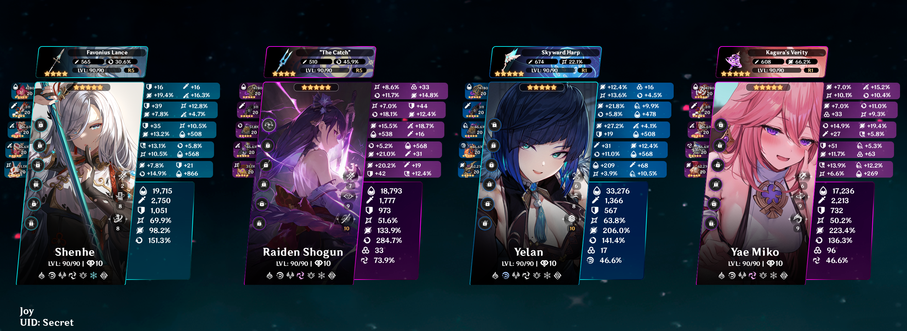

<h1 align="center">Joy's Anime Game Stats</h1>
<h3 align="center">🕒 Updated at <u>Jul 12, 2023 13:26 +0700</u></h3>
 

  

    
    Honkai Star Rail Details
  

  
  <h2>Info</h2>
  <table>
    <tr>
      <td>Nickname</td>
      <td>Joy</td>
    </tr>
    <tr>
      <td>Trailblaze Level</td>
      <td>62</td>
    </tr>
    <tr>
      <td>Server</td>
      <td>Asia</td>
    </tr>
  </table>

  <h2> Daily Rewards</h2>
  <table>
    <tr>
      <td>Total Rewards Claimed</td>
      <td>12</td>
    </tr>
    <tr>
      <td>Last Claimed Reward</td>
      <td>
        2 x
        
        Condensed Aether
      </td>
    </tr>
  </table>

  <h2>
    
    Stats
  </h2>
  <table>
    <tr></tr>
    <tr>
      <td>Days Active</td>
      <td>72</td>
    </tr>
    <tr>
      <td>Total Avatar</td>
      <td>18</td>
    </tr>
    <tr>
      <td>Total Achievement</td>
      <td>215</td>
    </tr>
    <tr>
      <td>Chests Opened</td>
      <td>273</td>
    </tr>
    <tr></tr>
  </table>

  <h2> Diary</h2>
  <table>
    <tr>
      <td>
         Stellar Jade
        earned
      </td>
      <td>1805 (rate -75)</td>
    </tr>
    <tr>
      <td>
        
        Pass & Special Pass earned
      </td>
      <td>13 (rate -67)</td>
    </tr>
    <tr>
      <td>Categories</td>
      <td>
        Daily Activity: 660 (36%) Simulated Universe: 475 (26%) Event:
        320 (17%) Mail: 320 (17%) Other: 0 (3%) Adventure
        Rewards: 30 (1%) Forgotten Hall: 0 (0%) 
      </td>
    </tr>
  </table>
  <h2>
    
    Characters
  </h2>
  

    
<b>Seele </b>

     
    <table>
      <tr>
        <th><h3>Seele</h3></th>
        <th><h3>Cruising in the Stellar Sea</h3></th>
      </tr>
      <tr>
        <td>
          

            
          

        </td>
        <td>
          

            
          

        </td>
      </tr>
      <tr>
        <td>
          <table>
            <tr>
              <td>Rarity</td>
              <td>★★★★★</td>
            </tr>
            <tr>
              <td>Element</td>
              <td>
                
              </td>
            </tr>
            <tr>
              <td>Level</td>
              <td>80</td>
            </tr>
            <tr>
              <td>Eidolon</td>
              <td>0</td>
            </tr>
            <tr>
              <td>Relics</td>
              <td>
                
                Genius's Ultraremote Sensing Visor 
                Genius's Frequency Catcher 
                Genius's Metafield Suit 
                Genius's Gravity Walker 
              </td>
            </tr>
            <tr>
              <td>Planar</td>
              <td>
                
                The Xianzhou Luofu's Celestial Ark 
                The Xianzhou Luofu's Ambrosial Arbor Vines 
              </td>
            </tr>
          </table>
        </td>
        <td valign="top">
          <table>
            <tr>
              <td>Name</td>
              <td>Cruising in the Stellar Sea</td>
            </tr>
            <tr>
              <td>Level</td>
              <td>80</td>
            </tr>
            <tr>
              <td>Superimpose</td>
              <td>5</td>
            </tr>
          </table>
        </td>
      </tr>
    </table>
  

  

    
<b>Clara </b>

     
    <table>
      <tr>
        <th><h3>Clara</h3></th>
        <th><h3>A Secret Vow</h3></th>
      </tr>
      <tr>
        <td>
          

            
          

        </td>
        <td>
          

            
          

        </td>
      </tr>
      <tr>
        <td>
          <table>
            <tr>
              <td>Rarity</td>
              <td>★★★★★</td>
            </tr>
            <tr>
              <td>Element</td>
              <td>
                
              </td>
            </tr>
            <tr>
              <td>Level</td>
              <td>80</td>
            </tr>
            <tr>
              <td>Eidolon</td>
              <td>0</td>
            </tr>
            <tr>
              <td>Relics</td>
              <td>
                
                Champion's Headgear 
                Champion's Heavy Gloves 
                Champion's Chest Guard 
                Champion's Fleetfoot Boots 
              </td>
            </tr>
            <tr>
              <td>Planar</td>
              <td>
                
                Herta's Space Station 
                Herta's Wandering Trek 
              </td>
            </tr>
          </table>
        </td>
        <td valign="top">
          <table>
            <tr>
              <td>Name</td>
              <td>A Secret Vow</td>
            </tr>
            <tr>
              <td>Level</td>
              <td>60</td>
            </tr>
            <tr>
              <td>Superimpose</td>
              <td>1</td>
            </tr>
          </table>
        </td>
      </tr>
    </table>
  

  

    
<b>Himeko </b>

     
    <table>
      <tr>
        <th><h3>Himeko</h3></th>
        <th><h3>Make the World Clamor</h3></th>
      </tr>
      <tr>
        <td>
          

            
          

        </td>
        <td>
          

            
          

        </td>
      </tr>
      <tr>
        <td>
          <table>
            <tr>
              <td>Rarity</td>
              <td>★★★★★</td>
            </tr>
            <tr>
              <td>Element</td>
              <td>
                
              </td>
            </tr>
            <tr>
              <td>Level</td>
              <td>60</td>
            </tr>
            <tr>
              <td>Eidolon</td>
              <td>0</td>
            </tr>
            <tr>
              <td>Relics</td>
              <td>
                
                Firesmith's Obsidian Goggles 
                Firesmith's Ring of Flame-Mastery 
                Firesmith's Fireproof Apron 
                Firesmith's Alloy Leg 
              </td>
            </tr>
            <tr>
              <td>Planar</td>
              <td>
                
                Planet Screwllum's Mechanical Sun 
                Planet Screwllum's Ring System 
              </td>
            </tr>
          </table>
        </td>
        <td valign="top">
          <table>
            <tr>
              <td>Name</td>
              <td>Make the World Clamor</td>
            </tr>
            <tr>
              <td>Level</td>
              <td>60</td>
            </tr>
            <tr>
              <td>Superimpose</td>
              <td>3</td>
            </tr>
          </table>
        </td>
      </tr>
    </table>
  

  

    
<b>Trailblazer </b>

     
    <table>
      <tr>
        <th><h3>Trailblazer</h3></th>
        <th><h3>Landau's Choice</h3></th>
      </tr>
      <tr>
        <td>
          

            
          

        </td>
        <td>
          

            
          

        </td>
      </tr>
      <tr>
        <td>
          <table>
            <tr>
              <td>Rarity</td>
              <td>★★★★★</td>
            </tr>
            <tr>
              <td>Element</td>
              <td>
                
              </td>
            </tr>
            <tr>
              <td>Level</td>
              <td>70</td>
            </tr>
            <tr>
              <td>Eidolon</td>
              <td>5</td>
            </tr>
            <tr>
              <td>Relics</td>
              <td>
                
                Knight's Forgiving Casque 
                Knight's Silent Oath Ring 
                Knight's Solemn Breastplate 
                Knight's Iron Boots of Order 
              </td>
            </tr>
            <tr>
              <td>Planar</td>
              <td>
                
                The Xianzhou Luofu's Celestial Ark 
                The Xianzhou Luofu's Ambrosial Arbor Vines 
              </td>
            </tr>
          </table>
        </td>
        <td valign="top">
          <table>
            <tr>
              <td>Name</td>
              <td>Landau's Choice</td>
            </tr>
            <tr>
              <td>Level</td>
              <td>60</td>
            </tr>
            <tr>
              <td>Superimpose</td>
              <td>1</td>
            </tr>
          </table>
        </td>
      </tr>
    </table>
  

  

    
<b>Natasha </b>

     
    <table>
      <tr>
        <th><h3>Natasha</h3></th>
        <th><h3>Post-Op Conversation</h3></th>
      </tr>
      <tr>
        <td>
          

            
          

        </td>
        <td>
          

            
          

        </td>
      </tr>
      <tr>
        <td>
          <table>
            <tr>
              <td>Rarity</td>
              <td>★★★★</td>
            </tr>
            <tr>
              <td>Element</td>
              <td>
                
              </td>
            </tr>
            <tr>
              <td>Level</td>
              <td>70</td>
            </tr>
            <tr>
              <td>Eidolon</td>
              <td>6</td>
            </tr>
            <tr>
              <td>Relics</td>
              <td>
                
                Passerby's Rejuvenated Wooden Hairstick 
                Passerby's Roaming Dragon Bracer 
                Passerby's Ragged Embroided Coat 
                Passerby's Stygian Hiking Boots 
              </td>
            </tr>
            <tr>
              <td>Planar</td>
              <td>
                
                The Xianzhou Luofu's Celestial Ark 
                The Xianzhou Luofu's Ambrosial Arbor Vines 
              </td>
            </tr>
          </table>
        </td>
        <td valign="top">
          <table>
            <tr>
              <td>Name</td>
              <td>Post-Op Conversation</td>
            </tr>
            <tr>
              <td>Level</td>
              <td>70</td>
            </tr>
            <tr>
              <td>Superimpose</td>
              <td>2</td>
            </tr>
          </table>
        </td>
      </tr>
    </table>
  

  

    
<b>Tingyun </b>

     
    <table>
      <tr>
        <th><h3>Tingyun</h3></th>
        <th><h3>Dance! Dance! Dance!</h3></th>
      </tr>
      <tr>
        <td>
          

            
          

        </td>
        <td>
          

            
          

        </td>
      </tr>
      <tr>
        <td>
          <table>
            <tr>
              <td>Rarity</td>
              <td>★★★★</td>
            </tr>
            <tr>
              <td>Element</td>
              <td>
                
              </td>
            </tr>
            <tr>
              <td>Level</td>
              <td>70</td>
            </tr>
            <tr>
              <td>Eidolon</td>
              <td>1</td>
            </tr>
            <tr>
              <td>Relics</td>
              <td>
                
                Musketeer's Wild Wheat Felt Hat 
                Musketeer's Coarse Leather Gloves 
                Musketeer's Wind-Hunting Shawl 
                Musketeer's Rivets Riding Boots 
              </td>
            </tr>
            <tr>
              <td>Planar</td>
              <td>
                
                The Xianzhou Luofu's Celestial Ark 
                The Xianzhou Luofu's Ambrosial Arbor Vines 
              </td>
            </tr>
          </table>
        </td>
        <td valign="top">
          <table>
            <tr>
              <td>Name</td>
              <td>Dance! Dance! Dance!</td>
            </tr>
            <tr>
              <td>Level</td>
              <td>70</td>
            </tr>
            <tr>
              <td>Superimpose</td>
              <td>1</td>
            </tr>
          </table>
        </td>
      </tr>
    </table>
  

  

    
<b>Jing Yuan </b>

     
    <table>
      <tr>
        <th><h3>Jing Yuan</h3></th>
        <th><h3>The Seriousness of Breakfast</h3></th>
      </tr>
      <tr>
        <td>
          

            
          

        </td>
        <td>
          

            
          

        </td>
      </tr>
      <tr>
        <td>
          <table>
            <tr>
              <td>Rarity</td>
              <td>★★★★★</td>
            </tr>
            <tr>
              <td>Element</td>
              <td>
                
              </td>
            </tr>
            <tr>
              <td>Level</td>
              <td>70</td>
            </tr>
            <tr>
              <td>Eidolon</td>
              <td>0</td>
            </tr>
            <tr>
              <td>Relics</td>
              <td>
                
                Musketeer's Wild Wheat Felt Hat 
                Musketeer's Coarse Leather Gloves 
                Musketeer's Wind-Hunting Shawl 
                Musketeer's Rivets Riding Boots 
              </td>
            </tr>
            <tr>
              <td>Planar</td>
              <td>
                
                Herta's Space Station 
                Herta's Wandering Trek 
              </td>
            </tr>
          </table>
        </td>
        <td valign="top">
          <table>
            <tr>
              <td>Name</td>
              <td>The Seriousness of Breakfast</td>
            </tr>
            <tr>
              <td>Level</td>
              <td>60</td>
            </tr>
            <tr>
              <td>Superimpose</td>
              <td>2</td>
            </tr>
          </table>
        </td>
      </tr>
    </table>
  

  

    
<b>Pela </b>

     
    <table>
      <tr>
        <th><h3>Pela</h3></th>
        <th><h3>Before the Tutorial Mission Starts</h3></th>
      </tr>
      <tr>
        <td>
          

            
          

        </td>
        <td>
          

            
          

        </td>
      </tr>
      <tr>
        <td>
          <table>
            <tr>
              <td>Rarity</td>
              <td>★★★★</td>
            </tr>
            <tr>
              <td>Element</td>
              <td>
                
              </td>
            </tr>
            <tr>
              <td>Level</td>
              <td>70</td>
            </tr>
            <tr>
              <td>Eidolon</td>
              <td>5</td>
            </tr>
            <tr>
              <td>Relics</td>
              <td>
                
                Hunter's Artaius Hood 
                Hunter's Lizard Gloves 
                Hunter's Ice Dragon Cloak 
                Hunter's Soft Elkskin Boots 
              </td>
            </tr>
            <tr>
              <td>Planar</td>
              <td>
                
                Salsotto's Moving City 
                Salsotto's Terminator Line 
              </td>
            </tr>
          </table>
        </td>
        <td valign="top">
          <table>
            <tr>
              <td>Name</td>
              <td>Before the Tutorial Mission Starts</td>
            </tr>
            <tr>
              <td>Level</td>
              <td>60</td>
            </tr>
            <tr>
              <td>Superimpose</td>
              <td>5</td>
            </tr>
          </table>
        </td>
      </tr>
    </table>
  

  

    
<b>Asta </b>

     
    <table>
      <tr>
        <th><h3>Asta</h3></th>
        <th><h3>Memories of the Past</h3></th>
      </tr>
      <tr>
        <td>
          

            
          

        </td>
        <td>
          

            
          

        </td>
      </tr>
      <tr>
        <td>
          <table>
            <tr>
              <td>Rarity</td>
              <td>★★★★</td>
            </tr>
            <tr>
              <td>Element</td>
              <td>
                
              </td>
            </tr>
            <tr>
              <td>Level</td>
              <td>70</td>
            </tr>
            <tr>
              <td>Eidolon</td>
              <td>2</td>
            </tr>
            <tr>
              <td>Relics</td>
              <td>
                
                Musketeer's Wild Wheat Felt Hat 
                Musketeer's Coarse Leather Gloves 
                Musketeer's Wind-Hunting Shawl 
                Musketeer's Rivets Riding Boots 
              </td>
            </tr>
            <tr>
              <td>Planar</td>
              <td>
                
                The Xianzhou Luofu's Celestial Ark 
                Planet Screwllum's Ring System 
              </td>
            </tr>
          </table>
        </td>
        <td valign="top">
          <table>
            <tr>
              <td>Name</td>
              <td>Memories of the Past</td>
            </tr>
            <tr>
              <td>Level</td>
              <td>60</td>
            </tr>
            <tr>
              <td>Superimpose</td>
              <td>3</td>
            </tr>
          </table>
        </td>
      </tr>
    </table>
  

  

    
<b>Sushang </b>

     
    <table>
      <tr>
        <th><h3>Sushang</h3></th>
        <th><h3>Swordplay</h3></th>
      </tr>
      <tr>
        <td>
          

            
          

        </td>
        <td>
          

            
          

        </td>
      </tr>
      <tr>
        <td>
          <table>
            <tr>
              <td>Rarity</td>
              <td>★★★★</td>
            </tr>
            <tr>
              <td>Element</td>
              <td>
                
              </td>
            </tr>
            <tr>
              <td>Level</td>
              <td>60</td>
            </tr>
            <tr>
              <td>Eidolon</td>
              <td>0</td>
            </tr>
            <tr>
              <td>Relics</td>
              <td>
                
                Thief's Myriad-Faced Mask 
                Thief's Gloves With Prints 
                Thief's Steel Grappling Hook 
                Thief's Meteor Boots 
              </td>
            </tr>
            <tr>
              <td>Planar</td>
              <td>
                
                The IPC's Mega HQ 
                The IPC's Trade Route 
              </td>
            </tr>
          </table>
        </td>
        <td valign="top">
          <table>
            <tr>
              <td>Name</td>
              <td>Swordplay</td>
            </tr>
            <tr>
              <td>Level</td>
              <td>50</td>
            </tr>
            <tr>
              <td>Superimpose</td>
              <td>1</td>
            </tr>
          </table>
        </td>
      </tr>
    </table>
  

  

    
<b>Serval </b>

     
    <table>
      <tr>
        <th><h3>Serval</h3></th>
        <th><h3>Sagacity</h3></th>
      </tr>
      <tr>
        <td>
          

            
          

        </td>
        <td>
          

            
          

        </td>
      </tr>
      <tr>
        <td>
          <table>
            <tr>
              <td>Rarity</td>
              <td>★★★★</td>
            </tr>
            <tr>
              <td>Element</td>
              <td>
                
              </td>
            </tr>
            <tr>
              <td>Level</td>
              <td>60</td>
            </tr>
            <tr>
              <td>Eidolon</td>
              <td>3</td>
            </tr>
            <tr>
              <td>Relics</td>
              <td>
                
                Thief's Myriad-Faced Mask 
                Musketeer's Coarse Leather Gloves 
              </td>
            </tr>
            <tr>
              <td>Planar</td>
              <td>
                
                Salsotto's Moving City 
                Salsotto's Terminator Line 
              </td>
            </tr>
          </table>
        </td>
        <td valign="top">
          <table>
            <tr>
              <td>Name</td>
              <td>Sagacity</td>
            </tr>
            <tr>
              <td>Level</td>
              <td>1</td>
            </tr>
            <tr>
              <td>Superimpose</td>
              <td>1</td>
            </tr>
          </table>
        </td>
      </tr>
    </table>
  

  

    
<b>March 7th </b>

     
    <table>
      <tr>
        <th><h3>March 7th</h3></th>
        <th><h3>We Are Wildfire</h3></th>
      </tr>
      <tr>
        <td>
          

            
          

        </td>
        <td>
          

            
          

        </td>
      </tr>
      <tr>
        <td>
          <table>
            <tr>
              <td>Rarity</td>
              <td>★★★★</td>
            </tr>
            <tr>
              <td>Element</td>
              <td>
                
              </td>
            </tr>
            <tr>
              <td>Level</td>
              <td>60</td>
            </tr>
            <tr>
              <td>Eidolon</td>
              <td>5</td>
            </tr>
            <tr>
              <td>Relics</td>
              <td>
                
                Knight's Forgiving Casque 
                Knight's Silent Oath Ring 
                Knight's Solemn Breastplate 
                Knight's Iron Boots of Order 
              </td>
            </tr>
            <tr>
              <td>Planar</td>
              <td>
                
                Belobog's Fortress of Preservation 
                Belobog's Iron Defense 
              </td>
            </tr>
          </table>
        </td>
        <td valign="top">
          <table>
            <tr>
              <td>Name</td>
              <td>We Are Wildfire</td>
            </tr>
            <tr>
              <td>Level</td>
              <td>60</td>
            </tr>
            <tr>
              <td>Superimpose</td>
              <td>3</td>
            </tr>
          </table>
        </td>
      </tr>
    </table>
  

  

    
<b>Sampo </b>

     
    <table>
      <tr>
        <th><h3>Sampo</h3></th>
        <th><h3></h3></th>
      </tr>
      <tr>
        <td>
          

            
          

        </td>
        <td>
          

        </td>
      </tr>
      <tr>
        <td>
          <table>
            <tr>
              <td>Rarity</td>
              <td>★★★★</td>
            </tr>
            <tr>
              <td>Element</td>
              <td>
                
              </td>
            </tr>
            <tr>
              <td>Level</td>
              <td>50</td>
            </tr>
            <tr>
              <td>Eidolon</td>
              <td>0</td>
            </tr>
            <tr>
              <td>Relics</td>
              <td>
                
                Thief's Myriad-Faced Mask 
                Thief's Gloves With Prints 
                Thief's Steel Grappling Hook 
                Thief's Meteor Boots 
              </td>
            </tr>
            <tr>
              <td>Planar</td>
              <td>
                
                Herta's Space Station 
                Herta's Wandering Trek 
              </td>
            </tr>
          </table>
        </td>
        <td valign="top">
          <table>
            <tr>
              <td>Name</td>
              <td></td>
            </tr>
            <tr>
              <td>Level</td>
              <td></td>
            </tr>
            <tr>
              <td>Superimpose</td>
              <td></td>
            </tr>
          </table>
        </td>
      </tr>
    </table>
  

  

    
<b>Dan Heng </b>

     
    <table>
      <tr>
        <th><h3>Dan Heng</h3></th>
        <th><h3>Only Silence Remains</h3></th>
      </tr>
      <tr>
        <td>
          

            
          

        </td>
        <td>
          

            
          

        </td>
      </tr>
      <tr>
        <td>
          <table>
            <tr>
              <td>Rarity</td>
              <td>★★★★</td>
            </tr>
            <tr>
              <td>Element</td>
              <td>
                
              </td>
            </tr>
            <tr>
              <td>Level</td>
              <td>50</td>
            </tr>
            <tr>
              <td>Eidolon</td>
              <td>3</td>
            </tr>
            <tr>
              <td>Relics</td>
              <td>
                
                Eagle's Beaked Helmet 
                Eagle's Soaring Ring 
                Eagle's Winged Suit Harness 
                Eagle's Quilted Puttees 
              </td>
            </tr>
            <tr>
              <td>Planar</td>
              <td>
                
                Herta's Space Station 
                Herta's Wandering Trek 
              </td>
            </tr>
          </table>
        </td>
        <td valign="top">
          <table>
            <tr>
              <td>Name</td>
              <td>Only Silence Remains</td>
            </tr>
            <tr>
              <td>Level</td>
              <td>50</td>
            </tr>
            <tr>
              <td>Superimpose</td>
              <td>2</td>
            </tr>
          </table>
        </td>
      </tr>
    </table>
  

  

    
<b>Qingque </b>

     
    <table>
      <tr>
        <th><h3>Qingque</h3></th>
        <th><h3></h3></th>
      </tr>
      <tr>
        <td>
          

            
          

        </td>
        <td>
          

        </td>
      </tr>
      <tr>
        <td>
          <table>
            <tr>
              <td>Rarity</td>
              <td>★★★★</td>
            </tr>
            <tr>
              <td>Element</td>
              <td>
                
              </td>
            </tr>
            <tr>
              <td>Level</td>
              <td>20</td>
            </tr>
            <tr>
              <td>Eidolon</td>
              <td>1</td>
            </tr>
            <tr>
              <td>Relics</td>
              <td></td>
            </tr>
          </table>
        </td>
        <td valign="top">
          <table>
            <tr>
              <td>Name</td>
              <td></td>
            </tr>
            <tr>
              <td>Level</td>
              <td></td>
            </tr>
            <tr>
              <td>Superimpose</td>
              <td></td>
            </tr>
          </table>
        </td>
      </tr>
    </table>
  

  

    
<b>Hook </b>

     
    <table>
      <tr>
        <th><h3>Hook</h3></th>
        <th><h3>The Moles Welcome You</h3></th>
      </tr>
      <tr>
        <td>
          

            
          

        </td>
        <td>
          

            
          

        </td>
      </tr>
      <tr>
        <td>
          <table>
            <tr>
              <td>Rarity</td>
              <td>★★★★</td>
            </tr>
            <tr>
              <td>Element</td>
              <td>
                
              </td>
            </tr>
            <tr>
              <td>Level</td>
              <td>20</td>
            </tr>
            <tr>
              <td>Eidolon</td>
              <td>3</td>
            </tr>
            <tr>
              <td>Relics</td>
              <td></td>
            </tr>
          </table>
        </td>
        <td valign="top">
          <table>
            <tr>
              <td>Name</td>
              <td>The Moles Welcome You</td>
            </tr>
            <tr>
              <td>Level</td>
              <td>30</td>
            </tr>
            <tr>
              <td>Superimpose</td>
              <td>2</td>
            </tr>
          </table>
        </td>
      </tr>
    </table>
  

  

    
<b>Herta </b>

     
    <table>
      <tr>
        <th><h3>Herta</h3></th>
        <th><h3></h3></th>
      </tr>
      <tr>
        <td>
          

            
          

        </td>
        <td>
          

        </td>
      </tr>
      <tr>
        <td>
          <table>
            <tr>
              <td>Rarity</td>
              <td>★★★★</td>
            </tr>
            <tr>
              <td>Element</td>
              <td>
                
              </td>
            </tr>
            <tr>
              <td>Level</td>
              <td>20</td>
            </tr>
            <tr>
              <td>Eidolon</td>
              <td>3</td>
            </tr>
            <tr>
              <td>Relics</td>
              <td></td>
            </tr>
          </table>
        </td>
        <td valign="top">
          <table>
            <tr>
              <td>Name</td>
              <td></td>
            </tr>
            <tr>
              <td>Level</td>
              <td></td>
            </tr>
            <tr>
              <td>Superimpose</td>
              <td></td>
            </tr>
          </table>
        </td>
      </tr>
    </table>
  

  

    
<b>Arlan </b>

     
    <table>
      <tr>
        <th><h3>Arlan</h3></th>
        <th><h3></h3></th>
      </tr>
      <tr>
        <td>
          

            
          

        </td>
        <td>
          

        </td>
      </tr>
      <tr>
        <td>
          <table>
            <tr>
              <td>Rarity</td>
              <td>★★★★</td>
            </tr>
            <tr>
              <td>Element</td>
              <td>
                
              </td>
            </tr>
            <tr>
              <td>Level</td>
              <td>20</td>
            </tr>
            <tr>
              <td>Eidolon</td>
              <td>0</td>
            </tr>
            <tr>
              <td>Relics</td>
              <td></td>
            </tr>
          </table>
        </td>
        <td valign="top">
          <table>
            <tr>
              <td>Name</td>
              <td></td>
            </tr>
            <tr>
              <td>Level</td>
              <td></td>
            </tr>
            <tr>
              <td>Superimpose</td>
              <td></td>
            </tr>
          </table>
        </td>
      </tr>
    </table>
  

  

    
    Genshin Impact Details
  

  
  <h2>Info</h2>
  <table>
    <tr>
      <td>Nickname</td>
      <td>Joy</td>
    </tr>
    <tr>
      <td>Adventure Rank</td>
      <td>60</td>
    </tr>
    <tr>
      <td>Server</td>
      <td>Asia</td>
    </tr>
  </table>

  <h2>
     Daily Rewards
  </h2>
  <table>
    <tr>
      <td>Total Rewards Claimed</td>
      <td>11</td>
    </tr>
    <tr>
      <td>Last Claimed Reward</td>
      <td>
        20 x
        
        Primogem
      </td>
    </tr>
  </table>

  <h2>
    
    Stats
  </h2>
  <table>
    <tr>
      <td>Achievements</td>
      <td>763</td>
    </tr>
    <tr>
      <td>Days Active</td>
      <td>722</td>
    </tr>
    <tr>
      <td>Characters</td>
      <td>51</td>
    </tr>
    <tr>
      <td>Waypoints Unlocked</td>
      <td>304</td>
    </tr>
    <tr>
      <td>Anemoculi</td>
      <td>66</td>
    </tr>
    <tr>
      <td>Geoculi</td>
      <td>131</td>
    </tr>
    <tr>
      <td>Dendroculi</td>
      <td>271</td>
    </tr>
    <tr>
      <td>Electroculi</td>
      <td>181</td>
    </tr>
    <tr>
      <td>Common Chests Opened</td>
      <td>2323</td>
    </tr>
    <tr>
      <td>Exquisite Chests Opened</td>
      <td>1416</td>
    </tr>
    <tr>
      <td>Precious Chests Opened</td>
      <td>437</td>
    </tr>
    <tr>
      <td>Luxurious Chests Opened</td>
      <td>170</td>
    </tr>
    <tr>
      <td>Remarkable Chests Opened</td>
      <td>158</td>
    </tr>
    <tr>
      <td>Domains Unlocked</td>
      <td>51</td>
    </tr>
  </table>

  <h2>
    
    Exploration
  </h2>
  <table>
    <tr>
      <th>Sumeru</th>
      <th>The Chasm: Underground Mines</th>
      <th>The Chasm</th>
      <th>Enkanomiya</th>
      <th>Inazuma</th>
      <th>Dragonspine</th>
      <th>Liyue</th>
      <th>Mondstadt</th>
    </tr>
    <tr>
      <td>
        

          
        

      </td>
      <td>
        

          
        

      </td>
      <td>
        

          
        

      </td>
      <td>
        

          
        

      </td>
      <td>
        

          
        

      </td>
      <td>
        

          
        

      </td>
      <td>
        

          
        

      </td>
      <td>
        

          
        

      </td>
    </tr>
    <tr>
      <td>
        <table>
          <tr>
            <td>Explored</td>
            <td>
              
            </td>
          </tr>
          <tr>
            <td>Reputation</td>
            <td>10</td>
          </tr>
        </table>
      </td>
      <td>
        <table>
          <tr>
            <td>Explored</td>
            <td>
              
            </td>
          </tr>
          <tr>
            <td>Offering</td>
            <td>10</td>
          </tr>
        </table>
      </td>
      <td>
        <table>
          <tr>
            <td>Explored</td>
            <td>
              
            </td>
          </tr>
          <tr>
            <td>Offering</td>
            <td>10</td>
          </tr>
        </table>
      </td>
      <td>
        <table>
          <tr>
            <td>Explored</td>
            <td>
              
            </td>
          </tr>
          <tr>
            <td>Offering</td>
            <td>0</td>
          </tr>
        </table>
      </td>
      <td>
        <table>
          <tr>
            <td>Explored</td>
            <td>
              
            </td>
          </tr>
          <tr>
            <td>Reputation</td>
            <td>10</td>
          </tr>
        </table>
      </td>
      <td>
        <table>
          <tr>
            <td>Explored</td>
            <td>
              
            </td>
          </tr>
          <tr>
            <td>Offering</td>
            <td>12</td>
          </tr>
        </table>
      </td>
      <td>
        <table>
          <tr>
            <td>Explored</td>
            <td>
              
            </td>
          </tr>
          <tr>
            <td>Reputation</td>
            <td>8</td>
          </tr>
        </table>
      </td>
      <td>
        <table>
          <tr>
            <td>Explored</td>
            <td>
              
            </td>
          </tr>
          <tr>
            <td>Reputation</td>
            <td>8</td>
          </tr>
        </table>
      </td>
    </tr>
  </table>
  <h2>
    
    Teapot
  </h2>
  <table>
    <tr>
      <td>Level</td>
      <td>10</td>
    </tr>
    <tr>
      <td>Comfort</td>
      <td>Fit for a King (21400)</td>
    </tr>
    <tr>
      <td>Items</td>
      <td>1211</td>
    </tr>
    <tr>
      <td>Visitors</td>
      <td>2</td>
    </tr>
  </table>
  <h2>
    
    Spiral Abyss
  </h2>
  <table>
    <tr>
      <td>Season</td>
      <td>73</td>
    </tr>
    <tr>
      <td>Total Battles</td>
      <td>13</td>
    </tr>
    <tr>
      <td>Total Wins</td>
      <td>12</td>
    </tr>
    <tr>
      <td>Max Floor</td>
      <td>12-3</td>
    </tr>
    <tr>
      <td>Total Stars</td>
      <td>36</td>
    </tr>
    <tr>
      <td>Most Played Characters</td>
      <td>
        
        Raiden Shogun (12) 
        Nahida (12) 
        Yelan (12) 
        Yae Miko (12) 
      </td>
    </tr>
    <tr>
      <td>Most Defeats</td>
      <td>
        
        Nahida (43) 
      </td>
    </tr>
    <tr>
      <td>Strongest Single Strike</td>
      <td>
        
        Raiden Shogun (71736) 
      </td>
    </tr>
    <tr>
      <td>Most Damage Taken</td>
      <td>
        
        Hu Tao (73297) 
      </td>
    </tr>
    <tr>
      <td>Elemental Bursts Unleashed</td>
      <td>
        
        Bennett (17) 
      </td>
    </tr>
    <tr>
      <td>Elemental Skills Cast</td>
      <td>
        
        Yae Miko (95) 
      </td>
    </tr>
  </table>
  <h2> Diary</h2>
  <table>
    <tr>
      <td>
        
        Primogems earned
      </td>
      <td>4352 (rate -7)</td>
    </tr>
    <tr>
      <td>
        
        Mora earned
      </td>
      <td>3419114 (rate -19)</td>
    </tr>
    <tr>
      <td>Categories</td>
      <td>
        Events: 1146 (27%) Adventure: 1146 (27%) Daily Activity: 700
        (16%) Mail: 700 (16%) Spiral Abyss: 600 (13%) Quests: 60
        (1%) Other: 0 (0%) 
      </td>
    </tr>
  </table>

  <h2>
    
    Characters
  </h2>
  

    
<b>Nahida</b>

     
    <table>
      <tr>
        <th><h3 align="center">Nahida</h3></th>
        <th><h3 align="center">A Thousand Floating Dreams</h3></th>
      </tr>
      <tr>
        <td>
          

            
          

        </td>
        <td>
          

            
          

        </td>
      </tr>
      <tr>
        <td>
          <table>
            <tr>
              <td>Rarity</td>
              <td>★★★★★</td>
            </tr>
            <tr>
              <td>Element</td>
              <td>
                
              </td>
            </tr>
            <tr>
              <td>Level</td>
              <td>90</td>
            </tr>
            <tr>
              <td>Friendship</td>
              <td>10</td>
            </tr>
            <tr>
              <td>Constellation</td>
              <td>0</td>
            </tr>
            <tr>
              <td>
                Artifacts 1 x Gilded Dreams 4 x Deepwood Memories 
              </td>
              <td>
                
                Dreaming Steelbloom 
                Scholar of Vines 
                A Time of Insight 
                Lamp of the Lost 
                Laurel Coronet 
              </td>
            </tr>
            <tr>
              <td>Outfits</td>
              <td></td>
            </tr>
          </table>
        </td>
        <td valign="top">
          <table>
            <tr>
              <td>Name</td>
              <td>A Thousand Floating Dreams</td>
            </tr>
            <tr>
              <td>Rarity</td>
              <td>★★★★★</td>
            </tr>
            <tr>
              <td>Level</td>
              <td>90</td>
            </tr>
            <tr>
              <td>Refinement</td>
              <td>1</td>
            </tr>
          </table>
        </td>
      </tr>
    </table>
  

  

    
<b>Raiden Shogun</b>

     
    <table>
      <tr>
        <th><h3 align="center">Raiden Shogun</h3></th>
        <th><h3 align="center">"The Catch"</h3></th>
      </tr>
      <tr>
        <td>
          

            
          

        </td>
        <td>
          

            
          

        </td>
      </tr>
      <tr>
        <td>
          <table>
            <tr>
              <td>Rarity</td>
              <td>★★★★★</td>
            </tr>
            <tr>
              <td>Element</td>
              <td>
                
              </td>
            </tr>
            <tr>
              <td>Level</td>
              <td>90</td>
            </tr>
            <tr>
              <td>Friendship</td>
              <td>10</td>
            </tr>
            <tr>
              <td>Constellation</td>
              <td>1</td>
            </tr>
            <tr>
              <td>
                Artifacts 4 x Emblem of Severed Fate 1 x Thundering
                Fury 
              </td>
              <td>
                
                Magnificent Tsuba 
                Sundered Feather 
                Storm Cage 
                Scarlet Vessel 
                Thunder Summoner's Crown 
              </td>
            </tr>
            <tr>
              <td>Outfits</td>
              <td></td>
            </tr>
          </table>
        </td>
        <td valign="top">
          <table>
            <tr>
              <td>Name</td>
              <td>"The Catch"</td>
            </tr>
            <tr>
              <td>Rarity</td>
              <td>★★★★</td>
            </tr>
            <tr>
              <td>Level</td>
              <td>90</td>
            </tr>
            <tr>
              <td>Refinement</td>
              <td>5</td>
            </tr>
          </table>
        </td>
      </tr>
    </table>
  

  

    
<b>Yelan</b>

     
    <table>
      <tr>
        <th><h3 align="center">Yelan</h3></th>
        <th><h3 align="center">Skyward Harp</h3></th>
      </tr>
      <tr>
        <td>
          

            
          

        </td>
        <td>
          

            
          

        </td>
      </tr>
      <tr>
        <td>
          <table>
            <tr>
              <td>Rarity</td>
              <td>★★★★★</td>
            </tr>
            <tr>
              <td>Element</td>
              <td>
                
              </td>
            </tr>
            <tr>
              <td>Level</td>
              <td>90</td>
            </tr>
            <tr>
              <td>Friendship</td>
              <td>10</td>
            </tr>
            <tr>
              <td>Constellation</td>
              <td>0</td>
            </tr>
            <tr>
              <td>
                Artifacts 4 x Emblem of Severed Fate 1 x Retracing
                Bolide 
              </td>
              <td>
                
                Magnificent Tsuba 
                Sundered Feather 
                Storm Cage 
                Summer Night's Waterballoon 
                Ornate Kabuto 
              </td>
            </tr>
            <tr>
              <td>Outfits</td>
              <td></td>
            </tr>
          </table>
        </td>
        <td valign="top">
          <table>
            <tr>
              <td>Name</td>
              <td>Skyward Harp</td>
            </tr>
            <tr>
              <td>Rarity</td>
              <td>★★★★★</td>
            </tr>
            <tr>
              <td>Level</td>
              <td>90</td>
            </tr>
            <tr>
              <td>Refinement</td>
              <td>1</td>
            </tr>
          </table>
        </td>
      </tr>
    </table>
  

  

    
<b>Yae Miko</b>

     
    <table>
      <tr>
        <th><h3 align="center">Yae Miko</h3></th>
        <th><h3 align="center">Kagura's Verity</h3></th>
      </tr>
      <tr>
        <td>
          

            
          

        </td>
        <td>
          

            
          

        </td>
      </tr>
      <tr>
        <td>
          <table>
            <tr>
              <td>Rarity</td>
              <td>★★★★★</td>
            </tr>
            <tr>
              <td>Element</td>
              <td>
                
              </td>
            </tr>
            <tr>
              <td>Level</td>
              <td>90</td>
            </tr>
            <tr>
              <td>Friendship</td>
              <td>10</td>
            </tr>
            <tr>
              <td>Constellation</td>
              <td>0</td>
            </tr>
            <tr>
              <td>
                Artifacts 2 x Shimenawa's Reminiscence 2 x Gladiator's
                Finale 1 x Pale Flame 
              </td>
              <td>
                
                Entangling Bloom 
                Shaft of Remembrance 
                Gladiator's Longing 
                Surpassing Cup 
                Gladiator's Triumphus 
              </td>
            </tr>
            <tr>
              <td>Outfits</td>
              <td></td>
            </tr>
          </table>
        </td>
        <td valign="top">
          <table>
            <tr>
              <td>Name</td>
              <td>Kagura's Verity</td>
            </tr>
            <tr>
              <td>Rarity</td>
              <td>★★★★★</td>
            </tr>
            <tr>
              <td>Level</td>
              <td>90</td>
            </tr>
            <tr>
              <td>Refinement</td>
              <td>1</td>
            </tr>
          </table>
        </td>
      </tr>
    </table>
  

  

    
<b>Yoimiya</b>

     
    <table>
      <tr>
        <th><h3 align="center">Yoimiya</h3></th>
        <th><h3 align="center">Rust</h3></th>
      </tr>
      <tr>
        <td>
          

            
          

        </td>
        <td>
          

            
          

        </td>
      </tr>
      <tr>
        <td>
          <table>
            <tr>
              <td>Rarity</td>
              <td>★★★★★</td>
            </tr>
            <tr>
              <td>Element</td>
              <td>
                
              </td>
            </tr>
            <tr>
              <td>Level</td>
              <td>90</td>
            </tr>
            <tr>
              <td>Friendship</td>
              <td>10</td>
            </tr>
            <tr>
              <td>Constellation</td>
              <td>0</td>
            </tr>
            <tr>
              <td>
                Artifacts 2 x Shimenawa's Reminiscence 2 x Gladiator's
                Finale 1 x Flower of Paradise Lost 
              </td>
              <td>
                
                Entangling Bloom 
                Shaft of Remembrance 
                Gladiator's Longing 
                Gladiator's Intoxication 
                Amethyst Crown 
              </td>
            </tr>
            <tr>
              <td>Outfits</td>
              <td></td>
            </tr>
          </table>
        </td>
        <td valign="top">
          <table>
            <tr>
              <td>Name</td>
              <td>Rust</td>
            </tr>
            <tr>
              <td>Rarity</td>
              <td>★★★★</td>
            </tr>
            <tr>
              <td>Level</td>
              <td>90</td>
            </tr>
            <tr>
              <td>Refinement</td>
              <td>3</td>
            </tr>
          </table>
        </td>
      </tr>
    </table>
  

  

    
<b>Hu Tao</b>

     
    <table>
      <tr>
        <th><h3 align="center">Hu Tao</h3></th>
        <th><h3 align="center">Primordial Jade Winged-Spear</h3></th>
      </tr>
      <tr>
        <td>
          

            
          

        </td>
        <td>
          

            
          

        </td>
      </tr>
      <tr>
        <td>
          <table>
            <tr>
              <td>Rarity</td>
              <td>★★★★★</td>
            </tr>
            <tr>
              <td>Element</td>
              <td>
                
              </td>
            </tr>
            <tr>
              <td>Level</td>
              <td>90</td>
            </tr>
            <tr>
              <td>Friendship</td>
              <td>10</td>
            </tr>
            <tr>
              <td>Constellation</td>
              <td>0</td>
            </tr>
            <tr>
              <td>
                Artifacts 4 x Crimson Witch of Flames 1 x Heart of
                Depth 
              </td>
              <td>
                
                Witch's Flower of Blaze 
                Witch's Ever-Burning Plume 
                Witch's End Time 
                Goblet of Thundering Deep 
                Witch's Scorching Hat 
              </td>
            </tr>
            <tr>
              <td>Outfits</td>
              <td></td>
            </tr>
          </table>
        </td>
        <td valign="top">
          <table>
            <tr>
              <td>Name</td>
              <td>Primordial Jade Winged-Spear</td>
            </tr>
            <tr>
              <td>Rarity</td>
              <td>★★★★★</td>
            </tr>
            <tr>
              <td>Level</td>
              <td>90</td>
            </tr>
            <tr>
              <td>Refinement</td>
              <td>1</td>
            </tr>
          </table>
        </td>
      </tr>
    </table>
  

  

    
<b>Kamisato Ayaka</b>

     
    <table>
      <tr>
        <th><h3 align="center">Kamisato Ayaka</h3></th>
        <th><h3 align="center">Mistsplitter Reforged</h3></th>
      </tr>
      <tr>
        <td>
          

            
          

        </td>
        <td>
          

            
          

        </td>
      </tr>
      <tr>
        <td>
          <table>
            <tr>
              <td>Rarity</td>
              <td>★★★★★</td>
            </tr>
            <tr>
              <td>Element</td>
              <td>
                
              </td>
            </tr>
            <tr>
              <td>Level</td>
              <td>90</td>
            </tr>
            <tr>
              <td>Friendship</td>
              <td>10</td>
            </tr>
            <tr>
              <td>Constellation</td>
              <td>0</td>
            </tr>
            <tr>
              <td>
                Artifacts 4 x Blizzard Strayer 1 x Emblem of Severed
                Fate 
              </td>
              <td>
                
                Snowswept Memory 
                Icebreaker's Resolve 
                Frozen Homeland's Demise 
                Scarlet Vessel 
                Broken Rime's Echo 
              </td>
            </tr>
            <tr>
              <td>Outfits</td>
              <td></td>
            </tr>
          </table>
        </td>
        <td valign="top">
          <table>
            <tr>
              <td>Name</td>
              <td>Mistsplitter Reforged</td>
            </tr>
            <tr>
              <td>Rarity</td>
              <td>★★★★★</td>
            </tr>
            <tr>
              <td>Level</td>
              <td>90</td>
            </tr>
            <tr>
              <td>Refinement</td>
              <td>1</td>
            </tr>
          </table>
        </td>
      </tr>
    </table>
  

  

    
<b>Kaedehara Kazuha</b>

     
    <table>
      <tr>
        <th><h3 align="center">Kaedehara Kazuha</h3></th>
        <th><h3 align="center">Primordial Jade Cutter</h3></th>
      </tr>
      <tr>
        <td>
          

            
          

        </td>
        <td>
          

            
          

        </td>
      </tr>
      <tr>
        <td>
          <table>
            <tr>
              <td>Rarity</td>
              <td>★★★★★</td>
            </tr>
            <tr>
              <td>Element</td>
              <td>
                
              </td>
            </tr>
            <tr>
              <td>Level</td>
              <td>90</td>
            </tr>
            <tr>
              <td>Friendship</td>
              <td>10</td>
            </tr>
            <tr>
              <td>Constellation</td>
              <td>0</td>
            </tr>
            <tr>
              <td>
                Artifacts 4 x Viridescent Venerer 1 x Gilded Dreams 
              </td>
              <td>
                
                In Remembrance of Viridescent Fields 
                Viridescent Arrow Feather 
                The Sunken Years 
                Viridescent Venerer's Vessel 
                Viridescent Venerer's Diadem 
              </td>
            </tr>
            <tr>
              <td>Outfits</td>
              <td></td>
            </tr>
          </table>
        </td>
        <td valign="top">
          <table>
            <tr>
              <td>Name</td>
              <td>Primordial Jade Cutter</td>
            </tr>
            <tr>
              <td>Rarity</td>
              <td>★★★★★</td>
            </tr>
            <tr>
              <td>Level</td>
              <td>90</td>
            </tr>
            <tr>
              <td>Refinement</td>
              <td>1</td>
            </tr>
          </table>
        </td>
      </tr>
    </table>
  

  

    
<b>Shenhe</b>

     
    <table>
      <tr>
        <th><h3 align="center">Shenhe</h3></th>
        <th><h3 align="center">Favonius Lance</h3></th>
      </tr>
      <tr>
        <td>
          

            
          

        </td>
        <td>
          

            
          

        </td>
      </tr>
      <tr>
        <td>
          <table>
            <tr>
              <td>Rarity</td>
              <td>★★★★★</td>
            </tr>
            <tr>
              <td>Element</td>
              <td>
                
              </td>
            </tr>
            <tr>
              <td>Level</td>
              <td>90</td>
            </tr>
            <tr>
              <td>Friendship</td>
              <td>10</td>
            </tr>
            <tr>
              <td>Constellation</td>
              <td>0</td>
            </tr>
            <tr>
              <td>
                Artifacts 3 x Gladiator's Finale 2 x Shimenawa's
                Reminiscence 
              </td>
              <td>
                
                Gladiator's Nostalgia 
                Shaft of Remembrance 
                Gladiator's Longing 
                Gladiator's Intoxication 
                Capricious Visage 
              </td>
            </tr>
            <tr>
              <td>Outfits</td>
              <td></td>
            </tr>
          </table>
        </td>
        <td valign="top">
          <table>
            <tr>
              <td>Name</td>
              <td>Favonius Lance</td>
            </tr>
            <tr>
              <td>Rarity</td>
              <td>★★★★</td>
            </tr>
            <tr>
              <td>Level</td>
              <td>90</td>
            </tr>
            <tr>
              <td>Refinement</td>
              <td>5</td>
            </tr>
          </table>
        </td>
      </tr>
    </table>
  

  

    
<b>Wanderer</b>

     
    <table>
      <tr>
        <th><h3 align="center">Wanderer</h3></th>
        <th><h3 align="center">The Widsith</h3></th>
      </tr>
      <tr>
        <td>
          

            
          

        </td>
        <td>
          

            
          

        </td>
      </tr>
      <tr>
        <td>
          <table>
            <tr>
              <td>Rarity</td>
              <td>★★★★★</td>
            </tr>
            <tr>
              <td>Element</td>
              <td>
                
              </td>
            </tr>
            <tr>
              <td>Level</td>
              <td>90</td>
            </tr>
            <tr>
              <td>Friendship</td>
              <td>10</td>
            </tr>
            <tr>
              <td>Constellation</td>
              <td>0</td>
            </tr>
            <tr>
              <td>
                Artifacts 2 x Desert Pavilion Chronicle 1 x Noblesse
                Oblige 1 x Gladiator's Finale 1 x Wanderer's Troupe 
              </td>
              <td>
                
                The First Days of the City of Kings 
                End of the Golden Realm 
                Royal Pocket Watch 
                Gladiator's Intoxication 
                Conductor's Top Hat 
              </td>
            </tr>
            <tr>
              <td>Outfits</td>
              <td></td>
            </tr>
          </table>
        </td>
        <td valign="top">
          <table>
            <tr>
              <td>Name</td>
              <td>The Widsith</td>
            </tr>
            <tr>
              <td>Rarity</td>
              <td>★★★★</td>
            </tr>
            <tr>
              <td>Level</td>
              <td>80</td>
            </tr>
            <tr>
              <td>Refinement</td>
              <td>3</td>
            </tr>
          </table>
        </td>
      </tr>
    </table>
  

  

    
<b>Baizhu</b>

     
    <table>
      <tr>
        <th><h3 align="center">Baizhu</h3></th>
        <th><h3 align="center">Prototype Amber</h3></th>
      </tr>
      <tr>
        <td>
          

            
          

        </td>
        <td>
          

            
          

        </td>
      </tr>
      <tr>
        <td>
          <table>
            <tr>
              <td>Rarity</td>
              <td>★★★★★</td>
            </tr>
            <tr>
              <td>Element</td>
              <td>
                
              </td>
            </tr>
            <tr>
              <td>Level</td>
              <td>90</td>
            </tr>
            <tr>
              <td>Friendship</td>
              <td>10</td>
            </tr>
            <tr>
              <td>Constellation</td>
              <td>0</td>
            </tr>
            <tr>
              <td>
                Artifacts 4 x Deepwood Memories 1 x Emblem of Severed
                Fate 
              </td>
              <td>
                
                Labyrinth Wayfarer 
                Scholar of Vines 
                A Time of Insight 
                Scarlet Vessel 
                Laurel Coronet 
              </td>
            </tr>
            <tr>
              <td>Outfits</td>
              <td></td>
            </tr>
          </table>
        </td>
        <td valign="top">
          <table>
            <tr>
              <td>Name</td>
              <td>Prototype Amber</td>
            </tr>
            <tr>
              <td>Rarity</td>
              <td>★★★★</td>
            </tr>
            <tr>
              <td>Level</td>
              <td>80</td>
            </tr>
            <tr>
              <td>Refinement</td>
              <td>1</td>
            </tr>
          </table>
        </td>
      </tr>
    </table>
  

  

    
<b>Bennett</b>

     
    <table>
      <tr>
        <th><h3 align="center">Bennett</h3></th>
        <th><h3 align="center">Aquila Favonia</h3></th>
      </tr>
      <tr>
        <td>
          

            
          

        </td>
        <td>
          

            
          

        </td>
      </tr>
      <tr>
        <td>
          <table>
            <tr>
              <td>Rarity</td>
              <td>★★★★</td>
            </tr>
            <tr>
              <td>Element</td>
              <td>
                
              </td>
            </tr>
            <tr>
              <td>Level</td>
              <td>90</td>
            </tr>
            <tr>
              <td>Friendship</td>
              <td>10</td>
            </tr>
            <tr>
              <td>Constellation</td>
              <td>5</td>
            </tr>
            <tr>
              <td>
                Artifacts 3 x Noblesse Oblige 2 x Emblem of Severed
                Fate 
              </td>
              <td>
                
                Royal Flora 
                Royal Plume 
                Royal Pocket Watch 
                Scarlet Vessel 
                Ornate Kabuto 
              </td>
            </tr>
            <tr>
              <td>Outfits</td>
              <td></td>
            </tr>
          </table>
        </td>
        <td valign="top">
          <table>
            <tr>
              <td>Name</td>
              <td>Aquila Favonia</td>
            </tr>
            <tr>
              <td>Rarity</td>
              <td>★★★★★</td>
            </tr>
            <tr>
              <td>Level</td>
              <td>90</td>
            </tr>
            <tr>
              <td>Refinement</td>
              <td>1</td>
            </tr>
          </table>
        </td>
      </tr>
    </table>
  

  

    
<b>Yanfei</b>

     
    <table>
      <tr>
        <th><h3 align="center">Yanfei</h3></th>
        <th><h3 align="center">Dodoco Tales</h3></th>
      </tr>
      <tr>
        <td>
          

            
          

        </td>
        <td>
          

            
          

        </td>
      </tr>
      <tr>
        <td>
          <table>
            <tr>
              <td>Rarity</td>
              <td>★★★★</td>
            </tr>
            <tr>
              <td>Element</td>
              <td>
                
              </td>
            </tr>
            <tr>
              <td>Level</td>
              <td>90</td>
            </tr>
            <tr>
              <td>Friendship</td>
              <td>10</td>
            </tr>
            <tr>
              <td>Constellation</td>
              <td>4</td>
            </tr>
            <tr>
              <td>Artifacts 4 x Wanderer's Troupe </td>
              <td>
                
                Troupe's Dawnlight 
                Bard's Arrow Feather 
                Concert's Final Hour 
                Conductor's Top Hat 
              </td>
            </tr>
            <tr>
              <td>Outfits</td>
              <td></td>
            </tr>
          </table>
        </td>
        <td valign="top">
          <table>
            <tr>
              <td>Name</td>
              <td>Dodoco Tales</td>
            </tr>
            <tr>
              <td>Rarity</td>
              <td>★★★★</td>
            </tr>
            <tr>
              <td>Level</td>
              <td>80</td>
            </tr>
            <tr>
              <td>Refinement</td>
              <td>3</td>
            </tr>
          </table>
        </td>
      </tr>
    </table>
  

  

    
<b>Qiqi</b>

     
    <table>
      <tr>
        <th><h3 align="center">Qiqi</h3></th>
        <th><h3 align="center">Aquila Favonia</h3></th>
      </tr>
      <tr>
        <td>
          

            
          

        </td>
        <td>
          

            
          

        </td>
      </tr>
      <tr>
        <td>
          <table>
            <tr>
              <td>Rarity</td>
              <td>★★★★★</td>
            </tr>
            <tr>
              <td>Element</td>
              <td>
                
              </td>
            </tr>
            <tr>
              <td>Level</td>
              <td>80</td>
            </tr>
            <tr>
              <td>Friendship</td>
              <td>10</td>
            </tr>
            <tr>
              <td>Constellation</td>
              <td>1</td>
            </tr>
            <tr>
              <td>Artifacts 4 x Maiden Beloved </td>
              <td>
                
                Maiden's Distant Love 
                Maiden's Heart-Stricken Infatuation 
                Maiden's Fleeting Leisure 
                Maiden's Fading Beauty 
              </td>
            </tr>
            <tr>
              <td>Outfits</td>
              <td></td>
            </tr>
          </table>
        </td>
        <td valign="top">
          <table>
            <tr>
              <td>Name</td>
              <td>Aquila Favonia</td>
            </tr>
            <tr>
              <td>Rarity</td>
              <td>★★★★★</td>
            </tr>
            <tr>
              <td>Level</td>
              <td>50</td>
            </tr>
            <tr>
              <td>Refinement</td>
              <td>1</td>
            </tr>
          </table>
        </td>
      </tr>
    </table>
  

  

    
<b>Keqing</b>

     
    <table>
      <tr>
        <th><h3 align="center">Keqing</h3></th>
        <th><h3 align="center">Lion's Roar</h3></th>
      </tr>
      <tr>
        <td>
          

            
          

        </td>
        <td>
          

            
          

        </td>
      </tr>
      <tr>
        <td>
          <table>
            <tr>
              <td>Rarity</td>
              <td>★★★★★</td>
            </tr>
            <tr>
              <td>Element</td>
              <td>
                
              </td>
            </tr>
            <tr>
              <td>Level</td>
              <td>80</td>
            </tr>
            <tr>
              <td>Friendship</td>
              <td>10</td>
            </tr>
            <tr>
              <td>Constellation</td>
              <td>0</td>
            </tr>
            <tr>
              <td>
                Artifacts 1 x Shimenawa's Reminiscence 1 x Deepwood
                Memories 2 x Gladiator's Finale 1 x Crimson Witch of
                Flames 
              </td>
              <td>
                
                Entangling Bloom 
                Scholar of Vines 
                Gladiator's Longing 
                Gladiator's Intoxication 
                Witch's Scorching Hat 
              </td>
            </tr>
            <tr>
              <td>Outfits</td>
              <td></td>
            </tr>
          </table>
        </td>
        <td valign="top">
          <table>
            <tr>
              <td>Name</td>
              <td>Lion's Roar</td>
            </tr>
            <tr>
              <td>Rarity</td>
              <td>★★★★</td>
            </tr>
            <tr>
              <td>Level</td>
              <td>80</td>
            </tr>
            <tr>
              <td>Refinement</td>
              <td>3</td>
            </tr>
          </table>
        </td>
      </tr>
    </table>
  

  

    
<b>Barbara</b>

     
    <table>
      <tr>
        <th><h3 align="center">Barbara</h3></th>
        <th><h3 align="center">Oathsworn Eye</h3></th>
      </tr>
      <tr>
        <td>
          

            
          

        </td>
        <td>
          

            
          

        </td>
      </tr>
      <tr>
        <td>
          <table>
            <tr>
              <td>Rarity</td>
              <td>★★★★</td>
            </tr>
            <tr>
              <td>Element</td>
              <td>
                
              </td>
            </tr>
            <tr>
              <td>Level</td>
              <td>80</td>
            </tr>
            <tr>
              <td>Friendship</td>
              <td>10</td>
            </tr>
            <tr>
              <td>Constellation</td>
              <td>2</td>
            </tr>
            <tr>
              <td>
                Artifacts 3 x Maiden Beloved 2 x Ocean-Hued Clam 
              </td>
              <td>
                
                Maiden's Distant Love 
                Maiden's Heart-Stricken Infatuation 
                Maiden's Passing Youth 
                Pearl Cage 
                Crown of Watatsumi 
              </td>
            </tr>
            <tr>
              <td>Outfits</td>
              <td>Summertime Sparkle</td>
            </tr>
          </table>
        </td>
        <td valign="top">
          <table>
            <tr>
              <td>Name</td>
              <td>Oathsworn Eye</td>
            </tr>
            <tr>
              <td>Rarity</td>
              <td>★★★★</td>
            </tr>
            <tr>
              <td>Level</td>
              <td>1</td>
            </tr>
            <tr>
              <td>Refinement</td>
              <td>5</td>
            </tr>
          </table>
        </td>
      </tr>
    </table>
  

  

    
<b>Xiangling</b>

     
    <table>
      <tr>
        <th><h3 align="center">Xiangling</h3></th>
        <th><h3 align="center">Dragon's Bane</h3></th>
      </tr>
      <tr>
        <td>
          

            
          

        </td>
        <td>
          

            
          

        </td>
      </tr>
      <tr>
        <td>
          <table>
            <tr>
              <td>Rarity</td>
              <td>★★★★</td>
            </tr>
            <tr>
              <td>Element</td>
              <td>
                
              </td>
            </tr>
            <tr>
              <td>Level</td>
              <td>80</td>
            </tr>
            <tr>
              <td>Friendship</td>
              <td>10</td>
            </tr>
            <tr>
              <td>Constellation</td>
              <td>5</td>
            </tr>
            <tr>
              <td>
                Artifacts 4 x Emblem of Severed Fate 1 x Desert
                Pavilion Chronicle 
              </td>
              <td>
                
                Magnificent Tsuba 
                Sundered Feather 
                Timepiece of the Lost Path 
                Scarlet Vessel 
                Ornate Kabuto 
              </td>
            </tr>
            <tr>
              <td>Outfits</td>
              <td></td>
            </tr>
          </table>
        </td>
        <td valign="top">
          <table>
            <tr>
              <td>Name</td>
              <td>Dragon's Bane</td>
            </tr>
            <tr>
              <td>Rarity</td>
              <td>★★★★</td>
            </tr>
            <tr>
              <td>Level</td>
              <td>90</td>
            </tr>
            <tr>
              <td>Refinement</td>
              <td>3</td>
            </tr>
          </table>
        </td>
      </tr>
    </table>
  

  

    
<b>Xingqiu</b>

     
    <table>
      <tr>
        <th><h3 align="center">Xingqiu</h3></th>
        <th><h3 align="center">Sacrificial Sword</h3></th>
      </tr>
      <tr>
        <td>
          

            
          

        </td>
        <td>
          

            
          

        </td>
      </tr>
      <tr>
        <td>
          <table>
            <tr>
              <td>Rarity</td>
              <td>★★★★</td>
            </tr>
            <tr>
              <td>Element</td>
              <td>
                
              </td>
            </tr>
            <tr>
              <td>Level</td>
              <td>80</td>
            </tr>
            <tr>
              <td>Friendship</td>
              <td>10</td>
            </tr>
            <tr>
              <td>Constellation</td>
              <td>5</td>
            </tr>
            <tr>
              <td>
                Artifacts 4 x Emblem of Severed Fate 1 x Gilded
                Dreams 
              </td>
              <td>
                
                Magnificent Tsuba 
                Sundered Feather 
                Storm Cage 
                Scarlet Vessel 
                Shadow of the Sand King 
              </td>
            </tr>
            <tr>
              <td>Outfits</td>
              <td></td>
            </tr>
          </table>
        </td>
        <td valign="top">
          <table>
            <tr>
              <td>Name</td>
              <td>Sacrificial Sword</td>
            </tr>
            <tr>
              <td>Rarity</td>
              <td>★★★★</td>
            </tr>
            <tr>
              <td>Level</td>
              <td>80</td>
            </tr>
            <tr>
              <td>Refinement</td>
              <td>4</td>
            </tr>
          </table>
        </td>
      </tr>
    </table>
  

  

    
<b>Ningguang</b>

     
    <table>
      <tr>
        <th><h3 align="center">Ningguang</h3></th>
        <th><h3 align="center">Skyward Atlas</h3></th>
      </tr>
      <tr>
        <td>
          

            
          

        </td>
        <td>
          

            
          

        </td>
      </tr>
      <tr>
        <td>
          <table>
            <tr>
              <td>Rarity</td>
              <td>★★★★</td>
            </tr>
            <tr>
              <td>Element</td>
              <td>
                
              </td>
            </tr>
            <tr>
              <td>Level</td>
              <td>80</td>
            </tr>
            <tr>
              <td>Friendship</td>
              <td>10</td>
            </tr>
            <tr>
              <td>Constellation</td>
              <td>6</td>
            </tr>
            <tr>
              <td>
                Artifacts 2 x Shimenawa's Reminiscence 1 x Crimson
                Witch of Flames 1 x Gladiator's Finale 
              </td>
              <td>
                
                Entangling Bloom 
                Witch's End Time 
                Gladiator's Intoxication 
                Capricious Visage 
              </td>
            </tr>
            <tr>
              <td>Outfits</td>
              <td>Orchid's Evening Gown</td>
            </tr>
          </table>
        </td>
        <td valign="top">
          <table>
            <tr>
              <td>Name</td>
              <td>Skyward Atlas</td>
            </tr>
            <tr>
              <td>Rarity</td>
              <td>★★★★★</td>
            </tr>
            <tr>
              <td>Level</td>
              <td>90</td>
            </tr>
            <tr>
              <td>Refinement</td>
              <td>1</td>
            </tr>
          </table>
        </td>
      </tr>
    </table>
  

  

    
<b>Rosaria</b>

     
    <table>
      <tr>
        <th><h3 align="center">Rosaria</h3></th>
        <th><h3 align="center">Dragonspine Spear</h3></th>
      </tr>
      <tr>
        <td>
          

            
          

        </td>
        <td>
          

            
          

        </td>
      </tr>
      <tr>
        <td>
          <table>
            <tr>
              <td>Rarity</td>
              <td>★★★★</td>
            </tr>
            <tr>
              <td>Element</td>
              <td>
                
              </td>
            </tr>
            <tr>
              <td>Level</td>
              <td>80</td>
            </tr>
            <tr>
              <td>Friendship</td>
              <td>10</td>
            </tr>
            <tr>
              <td>Constellation</td>
              <td>6</td>
            </tr>
            <tr>
              <td>
                Artifacts 2 x Emblem of Severed Fate 1 x Blizzard
                Strayer 1 x Lavawalker 
              </td>
              <td>
                
                Magnificent Tsuba 
                Storm Cage 
                Frost-Weaved Dignity 
                Lavawalker's Wisdom 
              </td>
            </tr>
            <tr>
              <td>Outfits</td>
              <td>To the Church's Free Spirit</td>
            </tr>
          </table>
        </td>
        <td valign="top">
          <table>
            <tr>
              <td>Name</td>
              <td>Dragonspine Spear</td>
            </tr>
            <tr>
              <td>Rarity</td>
              <td>★★★★</td>
            </tr>
            <tr>
              <td>Level</td>
              <td>80</td>
            </tr>
            <tr>
              <td>Refinement</td>
              <td>1</td>
            </tr>
          </table>
        </td>
      </tr>
    </table>
  

  

    
<b>Diluc</b>

     
    <table>
      <tr>
        <th><h3 align="center">Diluc</h3></th>
        <th><h3 align="center">The Unforged</h3></th>
      </tr>
      <tr>
        <td>
          

            
          

        </td>
        <td>
          

            
          

        </td>
      </tr>
      <tr>
        <td>
          <table>
            <tr>
              <td>Rarity</td>
              <td>★★★★★</td>
            </tr>
            <tr>
              <td>Element</td>
              <td>
                
              </td>
            </tr>
            <tr>
              <td>Level</td>
              <td>80</td>
            </tr>
            <tr>
              <td>Friendship</td>
              <td>8</td>
            </tr>
            <tr>
              <td>Constellation</td>
              <td>1</td>
            </tr>
            <tr>
              <td>Artifacts </td>
              <td></td>
            </tr>
            <tr>
              <td>Outfits</td>
              <td></td>
            </tr>
          </table>
        </td>
        <td valign="top">
          <table>
            <tr>
              <td>Name</td>
              <td>The Unforged</td>
            </tr>
            <tr>
              <td>Rarity</td>
              <td>★★★★★</td>
            </tr>
            <tr>
              <td>Level</td>
              <td>50</td>
            </tr>
            <tr>
              <td>Refinement</td>
              <td>1</td>
            </tr>
          </table>
        </td>
      </tr>
    </table>
  

  

    
<b>Traveler</b>

     
    <table>
      <tr>
        <th><h3 align="center">Traveler</h3></th>
        <th><h3 align="center">Skyward Blade</h3></th>
      </tr>
      <tr>
        <td>
          

            
          

        </td>
        <td>
          

            
          

        </td>
      </tr>
      <tr>
        <td>
          <table>
            <tr>
              <td>Rarity</td>
              <td>★★★★★</td>
            </tr>
            <tr>
              <td>Element</td>
              <td>
                
              </td>
            </tr>
            <tr>
              <td>Level</td>
              <td>80</td>
            </tr>
            <tr>
              <td>Friendship</td>
              <td>0</td>
            </tr>
            <tr>
              <td>Constellation</td>
              <td>6</td>
            </tr>
            <tr>
              <td>
                Artifacts 1 x Gladiator's Finale 1 x Shimenawa's
                Reminiscence 1 x Noblesse Oblige 
              </td>
              <td>
                
                Gladiator's Nostalgia 
                Morning Dew's Moment 
                Royal Masque 
              </td>
            </tr>
            <tr>
              <td>Outfits</td>
              <td></td>
            </tr>
          </table>
        </td>
        <td valign="top">
          <table>
            <tr>
              <td>Name</td>
              <td>Skyward Blade</td>
            </tr>
            <tr>
              <td>Rarity</td>
              <td>★★★★★</td>
            </tr>
            <tr>
              <td>Level</td>
              <td>80</td>
            </tr>
            <tr>
              <td>Refinement</td>
              <td>1</td>
            </tr>
          </table>
        </td>
      </tr>
    </table>
  

  

    
<b>Mona</b>

     
    <table>
      <tr>
        <th><h3 align="center">Mona</h3></th>
        <th><h3 align="center">Thrilling Tales of Dragon Slayers</h3></th>
      </tr>
      <tr>
        <td>
          

            
          

        </td>
        <td>
          

            
          

        </td>
      </tr>
      <tr>
        <td>
          <table>
            <tr>
              <td>Rarity</td>
              <td>★★★★★</td>
            </tr>
            <tr>
              <td>Element</td>
              <td>
                
              </td>
            </tr>
            <tr>
              <td>Level</td>
              <td>70</td>
            </tr>
            <tr>
              <td>Friendship</td>
              <td>10</td>
            </tr>
            <tr>
              <td>Constellation</td>
              <td>1</td>
            </tr>
            <tr>
              <td>Artifacts 5 x Instructor </td>
              <td>
                
                Instructor's Brooch 
                Instructor's Feather Accessory 
                Instructor's Pocket Watch 
                Instructor's Tea Cup 
                Instructor's Cap 
              </td>
            </tr>
            <tr>
              <td>Outfits</td>
              <td>Pact of Stars and Moon</td>
            </tr>
          </table>
        </td>
        <td valign="top">
          <table>
            <tr>
              <td>Name</td>
              <td>Thrilling Tales of Dragon Slayers</td>
            </tr>
            <tr>
              <td>Rarity</td>
              <td>★★★</td>
            </tr>
            <tr>
              <td>Level</td>
              <td>1</td>
            </tr>
            <tr>
              <td>Refinement</td>
              <td>5</td>
            </tr>
          </table>
        </td>
      </tr>
    </table>
  

  

    
<b>Fischl</b>

     
    <table>
      <tr>
        <th><h3 align="center">Fischl</h3></th>
        <th><h3 align="center">End of the Line</h3></th>
      </tr>
      <tr>
        <td>
          

            
          

        </td>
        <td>
          

            
          

        </td>
      </tr>
      <tr>
        <td>
          <table>
            <tr>
              <td>Rarity</td>
              <td>★★★★</td>
            </tr>
            <tr>
              <td>Element</td>
              <td>
                
              </td>
            </tr>
            <tr>
              <td>Level</td>
              <td>70</td>
            </tr>
            <tr>
              <td>Friendship</td>
              <td>10</td>
            </tr>
            <tr>
              <td>Constellation</td>
              <td>4</td>
            </tr>
            <tr>
              <td>
                Artifacts 1 x Shimenawa's Reminiscence 1 x Deepwood
                Memories 1 x Maiden Beloved 
              </td>
              <td>
                
                Morning Dew's Moment 
                Lamp of the Lost 
                Maiden's Fading Beauty 
              </td>
            </tr>
            <tr>
              <td>Outfits</td>
              <td></td>
            </tr>
          </table>
        </td>
        <td valign="top">
          <table>
            <tr>
              <td>Name</td>
              <td>End of the Line</td>
            </tr>
            <tr>
              <td>Rarity</td>
              <td>★★★★</td>
            </tr>
            <tr>
              <td>Level</td>
              <td>1</td>
            </tr>
            <tr>
              <td>Refinement</td>
              <td>5</td>
            </tr>
          </table>
        </td>
      </tr>
    </table>
  

  

    
<b>Noelle</b>

     
    <table>
      <tr>
        <th><h3 align="center">Noelle</h3></th>
        <th><h3 align="center">Favonius Greatsword</h3></th>
      </tr>
      <tr>
        <td>
          

            
          

        </td>
        <td>
          

            
          

        </td>
      </tr>
      <tr>
        <td>
          <table>
            <tr>
              <td>Rarity</td>
              <td>★★★★</td>
            </tr>
            <tr>
              <td>Element</td>
              <td>
                
              </td>
            </tr>
            <tr>
              <td>Level</td>
              <td>70</td>
            </tr>
            <tr>
              <td>Friendship</td>
              <td>10</td>
            </tr>
            <tr>
              <td>Constellation</td>
              <td>5</td>
            </tr>
            <tr>
              <td>Artifacts </td>
              <td></td>
            </tr>
            <tr>
              <td>Outfits</td>
              <td></td>
            </tr>
          </table>
        </td>
        <td valign="top">
          <table>
            <tr>
              <td>Name</td>
              <td>Favonius Greatsword</td>
            </tr>
            <tr>
              <td>Rarity</td>
              <td>★★★★</td>
            </tr>
            <tr>
              <td>Level</td>
              <td>20</td>
            </tr>
            <tr>
              <td>Refinement</td>
              <td>2</td>
            </tr>
          </table>
        </td>
      </tr>
    </table>
  

  

    
<b>Diona</b>

     
    <table>
      <tr>
        <th><h3 align="center">Diona</h3></th>
        <th><h3 align="center">Sacrificial Bow</h3></th>
      </tr>
      <tr>
        <td>
          

            
          

        </td>
        <td>
          

            
          

        </td>
      </tr>
      <tr>
        <td>
          <table>
            <tr>
              <td>Rarity</td>
              <td>★★★★</td>
            </tr>
            <tr>
              <td>Element</td>
              <td>
                
              </td>
            </tr>
            <tr>
              <td>Level</td>
              <td>70</td>
            </tr>
            <tr>
              <td>Friendship</td>
              <td>10</td>
            </tr>
            <tr>
              <td>Constellation</td>
              <td>6</td>
            </tr>
            <tr>
              <td>
                Artifacts 1 x Blizzard Strayer 1 x Heart of Depth 1
                x Gladiator's Finale 1 x Retracing Bolide 
              </td>
              <td>
                
                Icebreaker's Resolve 
                Copper Compass 
                Gladiator's Intoxication 
                Summer Night's Mask 
              </td>
            </tr>
            <tr>
              <td>Outfits</td>
              <td></td>
            </tr>
          </table>
        </td>
        <td valign="top">
          <table>
            <tr>
              <td>Name</td>
              <td>Sacrificial Bow</td>
            </tr>
            <tr>
              <td>Rarity</td>
              <td>★★★★</td>
            </tr>
            <tr>
              <td>Level</td>
              <td>1</td>
            </tr>
            <tr>
              <td>Refinement</td>
              <td>4</td>
            </tr>
          </table>
        </td>
      </tr>
    </table>
  

  

    
<b>Faruzan</b>

     
    <table>
      <tr>
        <th><h3 align="center">Faruzan</h3></th>
        <th><h3 align="center">Favonius Warbow</h3></th>
      </tr>
      <tr>
        <td>
          

            
          

        </td>
        <td>
          

            
          

        </td>
      </tr>
      <tr>
        <td>
          <table>
            <tr>
              <td>Rarity</td>
              <td>★★★★</td>
            </tr>
            <tr>
              <td>Element</td>
              <td>
                
              </td>
            </tr>
            <tr>
              <td>Level</td>
              <td>70</td>
            </tr>
            <tr>
              <td>Friendship</td>
              <td>10</td>
            </tr>
            <tr>
              <td>Constellation</td>
              <td>3</td>
            </tr>
            <tr>
              <td>Artifacts 1 x Noblesse Oblige </td>
              <td>
                
                Royal Masque 
              </td>
            </tr>
            <tr>
              <td>Outfits</td>
              <td></td>
            </tr>
          </table>
        </td>
        <td valign="top">
          <table>
            <tr>
              <td>Name</td>
              <td>Favonius Warbow</td>
            </tr>
            <tr>
              <td>Rarity</td>
              <td>★★★★</td>
            </tr>
            <tr>
              <td>Level</td>
              <td>80</td>
            </tr>
            <tr>
              <td>Refinement</td>
              <td>5</td>
            </tr>
          </table>
        </td>
      </tr>
    </table>
  

  

    
<b>Kuki Shinobu</b>

     
    <table>
      <tr>
        <th><h3 align="center">Kuki Shinobu</h3></th>
        <th><h3 align="center">Iron Sting</h3></th>
      </tr>
      <tr>
        <td>
          

            
          

        </td>
        <td>
          

            
          

        </td>
      </tr>
      <tr>
        <td>
          <table>
            <tr>
              <td>Rarity</td>
              <td>★★★★</td>
            </tr>
            <tr>
              <td>Element</td>
              <td>
                
              </td>
            </tr>
            <tr>
              <td>Level</td>
              <td>69</td>
            </tr>
            <tr>
              <td>Friendship</td>
              <td>10</td>
            </tr>
            <tr>
              <td>Constellation</td>
              <td>2</td>
            </tr>
            <tr>
              <td>
                Artifacts 4 x Gilded Dreams 1 x Emblem of Severed
                Fate 
              </td>
              <td>
                
                Dreaming Steelbloom 
                Feather of Judgment 
                Storm Cage 
                Honeyed Final Feast 
                Shadow of the Sand King 
              </td>
            </tr>
            <tr>
              <td>Outfits</td>
              <td></td>
            </tr>
          </table>
        </td>
        <td valign="top">
          <table>
            <tr>
              <td>Name</td>
              <td>Iron Sting</td>
            </tr>
            <tr>
              <td>Rarity</td>
              <td>★★★★</td>
            </tr>
            <tr>
              <td>Level</td>
              <td>80</td>
            </tr>
            <tr>
              <td>Refinement</td>
              <td>1</td>
            </tr>
          </table>
        </td>
      </tr>
    </table>
  

  

    
<b>Amber</b>

     
    <table>
      <tr>
        <th><h3 align="center">Amber</h3></th>
        <th><h3 align="center">Blackcliff Warbow</h3></th>
      </tr>
      <tr>
        <td>
          

            
          

        </td>
        <td>
          

            
          

        </td>
      </tr>
      <tr>
        <td>
          <table>
            <tr>
              <td>Rarity</td>
              <td>★★★★</td>
            </tr>
            <tr>
              <td>Element</td>
              <td>
                
              </td>
            </tr>
            <tr>
              <td>Level</td>
              <td>60</td>
            </tr>
            <tr>
              <td>Friendship</td>
              <td>10</td>
            </tr>
            <tr>
              <td>Constellation</td>
              <td>4</td>
            </tr>
            <tr>
              <td>
                Artifacts 4 x Wanderer's Troupe 1 x Emblem of Severed
                Fate 
              </td>
              <td>
                
                Troupe's Dawnlight 
                Bard's Arrow Feather 
                Concert's Final Hour 
                Scarlet Vessel 
                Conductor's Top Hat 
              </td>
            </tr>
            <tr>
              <td>Outfits</td>
              <td>100% Outrider</td>
            </tr>
          </table>
        </td>
        <td valign="top">
          <table>
            <tr>
              <td>Name</td>
              <td>Blackcliff Warbow</td>
            </tr>
            <tr>
              <td>Rarity</td>
              <td>★★★★</td>
            </tr>
            <tr>
              <td>Level</td>
              <td>70</td>
            </tr>
            <tr>
              <td>Refinement</td>
              <td>1</td>
            </tr>
          </table>
        </td>
      </tr>
    </table>
  

  

    
<b>Sucrose</b>

     
    <table>
      <tr>
        <th><h3 align="center">Sucrose</h3></th>
        <th><h3 align="center">Sacrificial Fragments</h3></th>
      </tr>
      <tr>
        <td>
          

            
          

        </td>
        <td>
          

            
          

        </td>
      </tr>
      <tr>
        <td>
          <table>
            <tr>
              <td>Rarity</td>
              <td>★★★★</td>
            </tr>
            <tr>
              <td>Element</td>
              <td>
                
              </td>
            </tr>
            <tr>
              <td>Level</td>
              <td>60</td>
            </tr>
            <tr>
              <td>Friendship</td>
              <td>10</td>
            </tr>
            <tr>
              <td>Constellation</td>
              <td>6</td>
            </tr>
            <tr>
              <td>
                Artifacts 3 x Viridescent Venerer 1 x Heart of
                Depth 1 x Maiden Beloved 
              </td>
              <td>
                
                In Remembrance of Viridescent Fields 
                Viridescent Arrow Feather 
                Copper Compass 
                Maiden's Fleeting Leisure 
                Viridescent Venerer's Diadem 
              </td>
            </tr>
            <tr>
              <td>Outfits</td>
              <td></td>
            </tr>
          </table>
        </td>
        <td valign="top">
          <table>
            <tr>
              <td>Name</td>
              <td>Sacrificial Fragments</td>
            </tr>
            <tr>
              <td>Rarity</td>
              <td>★★★★</td>
            </tr>
            <tr>
              <td>Level</td>
              <td>80</td>
            </tr>
            <tr>
              <td>Refinement</td>
              <td>4</td>
            </tr>
          </table>
        </td>
      </tr>
    </table>
  

  

    
<b>Sayu</b>

     
    <table>
      <tr>
        <th><h3 align="center">Sayu</h3></th>
        <th><h3 align="center">Prototype Archaic</h3></th>
      </tr>
      <tr>
        <td>
          

            
          

        </td>
        <td>
          

            
          

        </td>
      </tr>
      <tr>
        <td>
          <table>
            <tr>
              <td>Rarity</td>
              <td>★★★★</td>
            </tr>
            <tr>
              <td>Element</td>
              <td>
                
              </td>
            </tr>
            <tr>
              <td>Level</td>
              <td>60</td>
            </tr>
            <tr>
              <td>Friendship</td>
              <td>10</td>
            </tr>
            <tr>
              <td>Constellation</td>
              <td>6</td>
            </tr>
            <tr>
              <td>
                Artifacts 2 x Viridescent Venerer 1 x Emblem of
                Severed Fate 1 x Crimson Witch of Flames 1 x
                Shimenawa's Reminiscence 
              </td>
              <td>
                
                In Remembrance of Viridescent Fields 
                Viridescent Arrow Feather 
                Storm Cage 
                Witch's Heart Flames 
                Capricious Visage 
              </td>
            </tr>
            <tr>
              <td>Outfits</td>
              <td></td>
            </tr>
          </table>
        </td>
        <td valign="top">
          <table>
            <tr>
              <td>Name</td>
              <td>Prototype Archaic</td>
            </tr>
            <tr>
              <td>Rarity</td>
              <td>★★★★</td>
            </tr>
            <tr>
              <td>Level</td>
              <td>50</td>
            </tr>
            <tr>
              <td>Refinement</td>
              <td>3</td>
            </tr>
          </table>
        </td>
      </tr>
    </table>
  

  

    
<b>Kujou Sara</b>

     
    <table>
      <tr>
        <th><h3 align="center">Kujou Sara</h3></th>
        <th><h3 align="center">Alley Hunter</h3></th>
      </tr>
      <tr>
        <td>
          

            
          

        </td>
        <td>
          

            
          

        </td>
      </tr>
      <tr>
        <td>
          <table>
            <tr>
              <td>Rarity</td>
              <td>★★★★</td>
            </tr>
            <tr>
              <td>Element</td>
              <td>
                
              </td>
            </tr>
            <tr>
              <td>Level</td>
              <td>60</td>
            </tr>
            <tr>
              <td>Friendship</td>
              <td>10</td>
            </tr>
            <tr>
              <td>Constellation</td>
              <td>2</td>
            </tr>
            <tr>
              <td>
                Artifacts 2 x Emblem of Severed Fate 1 x Wanderer's
                Troupe 1 x Shimenawa's Reminiscence 1 x Gladiator's
                Finale 
              </td>
              <td>
                
                Magnificent Tsuba 
                Sundered Feather 
                Concert's Final Hour 
                Hopeful Heart 
                Gladiator's Triumphus 
              </td>
            </tr>
            <tr>
              <td>Outfits</td>
              <td></td>
            </tr>
          </table>
        </td>
        <td valign="top">
          <table>
            <tr>
              <td>Name</td>
              <td>Alley Hunter</td>
            </tr>
            <tr>
              <td>Rarity</td>
              <td>★★★★</td>
            </tr>
            <tr>
              <td>Level</td>
              <td>50</td>
            </tr>
            <tr>
              <td>Refinement</td>
              <td>1</td>
            </tr>
          </table>
        </td>
      </tr>
    </table>
  

  

    
<b>Lisa</b>

     
    <table>
      <tr>
        <th><h3 align="center">Lisa</h3></th>
        <th><h3 align="center">Eye of Perception</h3></th>
      </tr>
      <tr>
        <td>
          

            
          

        </td>
        <td>
          

            
          

        </td>
      </tr>
      <tr>
        <td>
          <table>
            <tr>
              <td>Rarity</td>
              <td>★★★★</td>
            </tr>
            <tr>
              <td>Element</td>
              <td>
                
              </td>
            </tr>
            <tr>
              <td>Level</td>
              <td>50</td>
            </tr>
            <tr>
              <td>Friendship</td>
              <td>10</td>
            </tr>
            <tr>
              <td>Constellation</td>
              <td>3</td>
            </tr>
            <tr>
              <td>Artifacts </td>
              <td></td>
            </tr>
            <tr>
              <td>Outfits</td>
              <td>A Sobriquet Under Shade</td>
            </tr>
          </table>
        </td>
        <td valign="top">
          <table>
            <tr>
              <td>Name</td>
              <td>Eye of Perception</td>
            </tr>
            <tr>
              <td>Rarity</td>
              <td>★★★★</td>
            </tr>
            <tr>
              <td>Level</td>
              <td>50</td>
            </tr>
            <tr>
              <td>Refinement</td>
              <td>5</td>
            </tr>
          </table>
        </td>
      </tr>
    </table>
  

  

    
<b>Beidou</b>

     
    <table>
      <tr>
        <th><h3 align="center">Beidou</h3></th>
        <th><h3 align="center">Luxurious Sea-Lord</h3></th>
      </tr>
      <tr>
        <td>
          

            
          

        </td>
        <td>
          

            
          

        </td>
      </tr>
      <tr>
        <td>
          <table>
            <tr>
              <td>Rarity</td>
              <td>★★★★</td>
            </tr>
            <tr>
              <td>Element</td>
              <td>
                
              </td>
            </tr>
            <tr>
              <td>Level</td>
              <td>50</td>
            </tr>
            <tr>
              <td>Friendship</td>
              <td>10</td>
            </tr>
            <tr>
              <td>Constellation</td>
              <td>5</td>
            </tr>
            <tr>
              <td>Artifacts </td>
              <td></td>
            </tr>
            <tr>
              <td>Outfits</td>
              <td></td>
            </tr>
          </table>
        </td>
        <td valign="top">
          <table>
            <tr>
              <td>Name</td>
              <td>Luxurious Sea-Lord</td>
            </tr>
            <tr>
              <td>Rarity</td>
              <td>★★★★</td>
            </tr>
            <tr>
              <td>Level</td>
              <td>40</td>
            </tr>
            <tr>
              <td>Refinement</td>
              <td>4</td>
            </tr>
          </table>
        </td>
      </tr>
    </table>
  

  

    
<b>Xinyan</b>

     
    <table>
      <tr>
        <th><h3 align="center">Xinyan</h3></th>
        <th><h3 align="center">Sacrificial Greatsword</h3></th>
      </tr>
      <tr>
        <td>
          

            
          

        </td>
        <td>
          

            
          

        </td>
      </tr>
      <tr>
        <td>
          <table>
            <tr>
              <td>Rarity</td>
              <td>★★★★</td>
            </tr>
            <tr>
              <td>Element</td>
              <td>
                
              </td>
            </tr>
            <tr>
              <td>Level</td>
              <td>50</td>
            </tr>
            <tr>
              <td>Friendship</td>
              <td>10</td>
            </tr>
            <tr>
              <td>Constellation</td>
              <td>4</td>
            </tr>
            <tr>
              <td>Artifacts </td>
              <td></td>
            </tr>
            <tr>
              <td>Outfits</td>
              <td></td>
            </tr>
          </table>
        </td>
        <td valign="top">
          <table>
            <tr>
              <td>Name</td>
              <td>Sacrificial Greatsword</td>
            </tr>
            <tr>
              <td>Rarity</td>
              <td>★★★★</td>
            </tr>
            <tr>
              <td>Level</td>
              <td>1</td>
            </tr>
            <tr>
              <td>Refinement</td>
              <td>3</td>
            </tr>
          </table>
        </td>
      </tr>
    </table>
  

  

    
<b>Chongyun</b>

     
    <table>
      <tr>
        <th><h3 align="center">Chongyun</h3></th>
        <th><h3 align="center">Snow-Tombed Starsilver</h3></th>
      </tr>
      <tr>
        <td>
          

            
          

        </td>
        <td>
          

            
          

        </td>
      </tr>
      <tr>
        <td>
          <table>
            <tr>
              <td>Rarity</td>
              <td>★★★★</td>
            </tr>
            <tr>
              <td>Element</td>
              <td>
                
              </td>
            </tr>
            <tr>
              <td>Level</td>
              <td>50</td>
            </tr>
            <tr>
              <td>Friendship</td>
              <td>5</td>
            </tr>
            <tr>
              <td>Constellation</td>
              <td>4</td>
            </tr>
            <tr>
              <td>Artifacts 1 x Emblem of Severed Fate </td>
              <td>
                
                Ornate Kabuto 
              </td>
            </tr>
            <tr>
              <td>Outfits</td>
              <td></td>
            </tr>
          </table>
        </td>
        <td valign="top">
          <table>
            <tr>
              <td>Name</td>
              <td>Snow-Tombed Starsilver</td>
            </tr>
            <tr>
              <td>Rarity</td>
              <td>★★★★</td>
            </tr>
            <tr>
              <td>Level</td>
              <td>20</td>
            </tr>
            <tr>
              <td>Refinement</td>
              <td>1</td>
            </tr>
          </table>
        </td>
      </tr>
    </table>
  

  

    
<b>Kaeya</b>

     
    <table>
      <tr>
        <th><h3 align="center">Kaeya</h3></th>
        <th><h3 align="center">Amenoma Kageuchi</h3></th>
      </tr>
      <tr>
        <td>
          

            
          

        </td>
        <td>
          

            
          

        </td>
      </tr>
      <tr>
        <td>
          <table>
            <tr>
              <td>Rarity</td>
              <td>★★★★</td>
            </tr>
            <tr>
              <td>Element</td>
              <td>
                
              </td>
            </tr>
            <tr>
              <td>Level</td>
              <td>50</td>
            </tr>
            <tr>
              <td>Friendship</td>
              <td>3</td>
            </tr>
            <tr>
              <td>Constellation</td>
              <td>0</td>
            </tr>
            <tr>
              <td>Artifacts 1 x Gladiator's Finale </td>
              <td>
                
                Gladiator's Nostalgia 
              </td>
            </tr>
            <tr>
              <td>Outfits</td>
              <td>Sailwind Shadow</td>
            </tr>
          </table>
        </td>
        <td valign="top">
          <table>
            <tr>
              <td>Name</td>
              <td>Amenoma Kageuchi</td>
            </tr>
            <tr>
              <td>Rarity</td>
              <td>★★★★</td>
            </tr>
            <tr>
              <td>Level</td>
              <td>20</td>
            </tr>
            <tr>
              <td>Refinement</td>
              <td>1</td>
            </tr>
          </table>
        </td>
      </tr>
    </table>
  

  

    
<b>Arataki Itto</b>

     
    <table>
      <tr>
        <th><h3 align="center">Arataki Itto</h3></th>
        <th><h3 align="center">Whiteblind</h3></th>
      </tr>
      <tr>
        <td>
          

            
          

        </td>
        <td>
          

            
          

        </td>
      </tr>
      <tr>
        <td>
          <table>
            <tr>
              <td>Rarity</td>
              <td>★★★★★</td>
            </tr>
            <tr>
              <td>Element</td>
              <td>
                
              </td>
            </tr>
            <tr>
              <td>Level</td>
              <td>40</td>
            </tr>
            <tr>
              <td>Friendship</td>
              <td>8</td>
            </tr>
            <tr>
              <td>Constellation</td>
              <td>0</td>
            </tr>
            <tr>
              <td>Artifacts </td>
              <td></td>
            </tr>
            <tr>
              <td>Outfits</td>
              <td></td>
            </tr>
          </table>
        </td>
        <td valign="top">
          <table>
            <tr>
              <td>Name</td>
              <td>Whiteblind</td>
            </tr>
            <tr>
              <td>Rarity</td>
              <td>★★★★</td>
            </tr>
            <tr>
              <td>Level</td>
              <td>80</td>
            </tr>
            <tr>
              <td>Refinement</td>
              <td>1</td>
            </tr>
          </table>
        </td>
      </tr>
    </table>
  

  

    
<b>Collei</b>

     
    <table>
      <tr>
        <th><h3 align="center">Collei</h3></th>
        <th><h3 align="center">Hunter's Bow</h3></th>
      </tr>
      <tr>
        <td>
          

            
          

        </td>
        <td>
          

            
          

        </td>
      </tr>
      <tr>
        <td>
          <table>
            <tr>
              <td>Rarity</td>
              <td>★★★★</td>
            </tr>
            <tr>
              <td>Element</td>
              <td>
                
              </td>
            </tr>
            <tr>
              <td>Level</td>
              <td>21</td>
            </tr>
            <tr>
              <td>Friendship</td>
              <td>10</td>
            </tr>
            <tr>
              <td>Constellation</td>
              <td>2</td>
            </tr>
            <tr>
              <td>Artifacts </td>
              <td></td>
            </tr>
            <tr>
              <td>Outfits</td>
              <td></td>
            </tr>
          </table>
        </td>
        <td valign="top">
          <table>
            <tr>
              <td>Name</td>
              <td>Hunter's Bow</td>
            </tr>
            <tr>
              <td>Rarity</td>
              <td>★</td>
            </tr>
            <tr>
              <td>Level</td>
              <td>1</td>
            </tr>
            <tr>
              <td>Refinement</td>
              <td>1</td>
            </tr>
          </table>
        </td>
      </tr>
    </table>
  

  

    
<b>Dori</b>

     
    <table>
      <tr>
        <th><h3 align="center">Dori</h3></th>
        <th><h3 align="center">The Bell</h3></th>
      </tr>
      <tr>
        <td>
          

            
          

        </td>
        <td>
          

            
          

        </td>
      </tr>
      <tr>
        <td>
          <table>
            <tr>
              <td>Rarity</td>
              <td>★★★★</td>
            </tr>
            <tr>
              <td>Element</td>
              <td>
                
              </td>
            </tr>
            <tr>
              <td>Level</td>
              <td>21</td>
            </tr>
            <tr>
              <td>Friendship</td>
              <td>10</td>
            </tr>
            <tr>
              <td>Constellation</td>
              <td>2</td>
            </tr>
            <tr>
              <td>Artifacts </td>
              <td></td>
            </tr>
            <tr>
              <td>Outfits</td>
              <td></td>
            </tr>
          </table>
        </td>
        <td valign="top">
          <table>
            <tr>
              <td>Name</td>
              <td>The Bell</td>
            </tr>
            <tr>
              <td>Rarity</td>
              <td>★★★★</td>
            </tr>
            <tr>
              <td>Level</td>
              <td>20</td>
            </tr>
            <tr>
              <td>Refinement</td>
              <td>3</td>
            </tr>
          </table>
        </td>
      </tr>
    </table>
  

  

    
<b>Candace</b>

     
    <table>
      <tr>
        <th><h3 align="center">Candace</h3></th>
        <th><h3 align="center">Missive Windspear</h3></th>
      </tr>
      <tr>
        <td>
          

            
          

        </td>
        <td>
          

            
          

        </td>
      </tr>
      <tr>
        <td>
          <table>
            <tr>
              <td>Rarity</td>
              <td>★★★★</td>
            </tr>
            <tr>
              <td>Element</td>
              <td>
                
              </td>
            </tr>
            <tr>
              <td>Level</td>
              <td>21</td>
            </tr>
            <tr>
              <td>Friendship</td>
              <td>10</td>
            </tr>
            <tr>
              <td>Constellation</td>
              <td>3</td>
            </tr>
            <tr>
              <td>Artifacts </td>
              <td></td>
            </tr>
            <tr>
              <td>Outfits</td>
              <td></td>
            </tr>
          </table>
        </td>
        <td valign="top">
          <table>
            <tr>
              <td>Name</td>
              <td>Missive Windspear</td>
            </tr>
            <tr>
              <td>Rarity</td>
              <td>★★★★</td>
            </tr>
            <tr>
              <td>Level</td>
              <td>1</td>
            </tr>
            <tr>
              <td>Refinement</td>
              <td>1</td>
            </tr>
          </table>
        </td>
      </tr>
    </table>
  

  

    
<b>Layla</b>

     
    <table>
      <tr>
        <th><h3 align="center">Layla</h3></th>
        <th><h3 align="center">Favonius Sword</h3></th>
      </tr>
      <tr>
        <td>
          

            
          

        </td>
        <td>
          

            
          

        </td>
      </tr>
      <tr>
        <td>
          <table>
            <tr>
              <td>Rarity</td>
              <td>★★★★</td>
            </tr>
            <tr>
              <td>Element</td>
              <td>
                
              </td>
            </tr>
            <tr>
              <td>Level</td>
              <td>21</td>
            </tr>
            <tr>
              <td>Friendship</td>
              <td>10</td>
            </tr>
            <tr>
              <td>Constellation</td>
              <td>2</td>
            </tr>
            <tr>
              <td>Artifacts 2 x Tenacity of the Millelith </td>
              <td>
                
                Flower of Accolades 
                Ceremonial War-Plume 
              </td>
            </tr>
            <tr>
              <td>Outfits</td>
              <td></td>
            </tr>
          </table>
        </td>
        <td valign="top">
          <table>
            <tr>
              <td>Name</td>
              <td>Favonius Sword</td>
            </tr>
            <tr>
              <td>Rarity</td>
              <td>★★★★</td>
            </tr>
            <tr>
              <td>Level</td>
              <td>70</td>
            </tr>
            <tr>
              <td>Refinement</td>
              <td>5</td>
            </tr>
          </table>
        </td>
      </tr>
    </table>
  

  

    
<b>Yaoyao</b>

     
    <table>
      <tr>
        <th><h3 align="center">Yaoyao</h3></th>
        <th><h3 align="center">Black Tassel</h3></th>
      </tr>
      <tr>
        <td>
          

            
          

        </td>
        <td>
          

            
          

        </td>
      </tr>
      <tr>
        <td>
          <table>
            <tr>
              <td>Rarity</td>
              <td>★★★★</td>
            </tr>
            <tr>
              <td>Element</td>
              <td>
                
              </td>
            </tr>
            <tr>
              <td>Level</td>
              <td>21</td>
            </tr>
            <tr>
              <td>Friendship</td>
              <td>10</td>
            </tr>
            <tr>
              <td>Constellation</td>
              <td>1</td>
            </tr>
            <tr>
              <td>Artifacts </td>
              <td></td>
            </tr>
            <tr>
              <td>Outfits</td>
              <td></td>
            </tr>
          </table>
        </td>
        <td valign="top">
          <table>
            <tr>
              <td>Name</td>
              <td>Black Tassel</td>
            </tr>
            <tr>
              <td>Rarity</td>
              <td>★★★</td>
            </tr>
            <tr>
              <td>Level</td>
              <td>1</td>
            </tr>
            <tr>
              <td>Refinement</td>
              <td>5</td>
            </tr>
          </table>
        </td>
      </tr>
    </table>
  

  

    
<b>Yun Jin</b>

     
    <table>
      <tr>
        <th><h3 align="center">Yun Jin</h3></th>
        <th><h3 align="center">Prototype Starglitter</h3></th>
      </tr>
      <tr>
        <td>
          

            
          

        </td>
        <td>
          

            
          

        </td>
      </tr>
      <tr>
        <td>
          <table>
            <tr>
              <td>Rarity</td>
              <td>★★★★</td>
            </tr>
            <tr>
              <td>Element</td>
              <td>
                
              </td>
            </tr>
            <tr>
              <td>Level</td>
              <td>20</td>
            </tr>
            <tr>
              <td>Friendship</td>
              <td>10</td>
            </tr>
            <tr>
              <td>Constellation</td>
              <td>3</td>
            </tr>
            <tr>
              <td>Artifacts 3 x Emblem of Severed Fate </td>
              <td>
                
                Storm Cage 
                Scarlet Vessel 
                Ornate Kabuto 
              </td>
            </tr>
            <tr>
              <td>Outfits</td>
              <td></td>
            </tr>
          </table>
        </td>
        <td valign="top">
          <table>
            <tr>
              <td>Name</td>
              <td>Prototype Starglitter</td>
            </tr>
            <tr>
              <td>Rarity</td>
              <td>★★★★</td>
            </tr>
            <tr>
              <td>Level</td>
              <td>1</td>
            </tr>
            <tr>
              <td>Refinement</td>
              <td>1</td>
            </tr>
          </table>
        </td>
      </tr>
    </table>
  

  

    
<b>Aloy</b>

     
    <table>
      <tr>
        <th><h3 align="center">Aloy</h3></th>
        <th><h3 align="center">Hunter's Bow</h3></th>
      </tr>
      <tr>
        <td>
          

            
          

        </td>
        <td>
          

            
          

        </td>
      </tr>
      <tr>
        <td>
          <table>
            <tr>
              <td>Rarity</td>
              <td>★★★★★</td>
            </tr>
            <tr>
              <td>Element</td>
              <td>
                
              </td>
            </tr>
            <tr>
              <td>Level</td>
              <td>20</td>
            </tr>
            <tr>
              <td>Friendship</td>
              <td>5</td>
            </tr>
            <tr>
              <td>Constellation</td>
              <td>0</td>
            </tr>
            <tr>
              <td>Artifacts </td>
              <td></td>
            </tr>
            <tr>
              <td>Outfits</td>
              <td></td>
            </tr>
          </table>
        </td>
        <td valign="top">
          <table>
            <tr>
              <td>Name</td>
              <td>Hunter's Bow</td>
            </tr>
            <tr>
              <td>Rarity</td>
              <td>★</td>
            </tr>
            <tr>
              <td>Level</td>
              <td>1</td>
            </tr>
            <tr>
              <td>Refinement</td>
              <td>1</td>
            </tr>
          </table>
        </td>
      </tr>
    </table>
  

  

    
<b>Dehya</b>

     
    <table>
      <tr>
        <th><h3 align="center">Dehya</h3></th>
        <th><h3 align="center">Sacrificial Greatsword</h3></th>
      </tr>
      <tr>
        <td>
          

            
          

        </td>
        <td>
          

            
          

        </td>
      </tr>
      <tr>
        <td>
          <table>
            <tr>
              <td>Rarity</td>
              <td>★★★★★</td>
            </tr>
            <tr>
              <td>Element</td>
              <td>
                
              </td>
            </tr>
            <tr>
              <td>Level</td>
              <td>20</td>
            </tr>
            <tr>
              <td>Friendship</td>
              <td>2</td>
            </tr>
            <tr>
              <td>Constellation</td>
              <td>0</td>
            </tr>
            <tr>
              <td>Artifacts </td>
              <td></td>
            </tr>
            <tr>
              <td>Outfits</td>
              <td></td>
            </tr>
          </table>
        </td>
        <td valign="top">
          <table>
            <tr>
              <td>Name</td>
              <td>Sacrificial Greatsword</td>
            </tr>
            <tr>
              <td>Rarity</td>
              <td>★★★★</td>
            </tr>
            <tr>
              <td>Level</td>
              <td>50</td>
            </tr>
            <tr>
              <td>Refinement</td>
              <td>5</td>
            </tr>
          </table>
        </td>
      </tr>
    </table>
  

  

    
<b>Mika</b>

     
    <table>
      <tr>
        <th><h3 align="center">Mika</h3></th>
        <th><h3 align="center">Beginner's Protector</h3></th>
      </tr>
      <tr>
        <td>
          

            
          

        </td>
        <td>
          

            
          

        </td>
      </tr>
      <tr>
        <td>
          <table>
            <tr>
              <td>Rarity</td>
              <td>★★★★</td>
            </tr>
            <tr>
              <td>Element</td>
              <td>
                
              </td>
            </tr>
            <tr>
              <td>Level</td>
              <td>20</td>
            </tr>
            <tr>
              <td>Friendship</td>
              <td>2</td>
            </tr>
            <tr>
              <td>Constellation</td>
              <td>3</td>
            </tr>
            <tr>
              <td>Artifacts </td>
              <td></td>
            </tr>
            <tr>
              <td>Outfits</td>
              <td></td>
            </tr>
          </table>
        </td>
        <td valign="top">
          <table>
            <tr>
              <td>Name</td>
              <td>Beginner's Protector</td>
            </tr>
            <tr>
              <td>Rarity</td>
              <td>★</td>
            </tr>
            <tr>
              <td>Level</td>
              <td>1</td>
            </tr>
            <tr>
              <td>Refinement</td>
              <td>1</td>
            </tr>
          </table>
        </td>
      </tr>
    </table>
  

  

    
<b>Kaveh</b>

     
    <table>
      <tr>
        <th><h3 align="center">Kaveh</h3></th>
        <th><h3 align="center">Waster Greatsword</h3></th>
      </tr>
      <tr>
        <td>
          

            
          

        </td>
        <td>
          

            
          

        </td>
      </tr>
      <tr>
        <td>
          <table>
            <tr>
              <td>Rarity</td>
              <td>★★★★</td>
            </tr>
            <tr>
              <td>Element</td>
              <td>
                
              </td>
            </tr>
            <tr>
              <td>Level</td>
              <td>20</td>
            </tr>
            <tr>
              <td>Friendship</td>
              <td>2</td>
            </tr>
            <tr>
              <td>Constellation</td>
              <td>1</td>
            </tr>
            <tr>
              <td>Artifacts </td>
              <td></td>
            </tr>
            <tr>
              <td>Outfits</td>
              <td></td>
            </tr>
          </table>
        </td>
        <td valign="top">
          <table>
            <tr>
              <td>Name</td>
              <td>Waster Greatsword</td>
            </tr>
            <tr>
              <td>Rarity</td>
              <td>★</td>
            </tr>
            <tr>
              <td>Level</td>
              <td>1</td>
            </tr>
            <tr>
              <td>Refinement</td>
              <td>1</td>
            </tr>
          </table>
        </td>
      </tr>
    </table>
  

  

    
<b>Razor</b>

     
    <table>
      <tr>
        <th><h3 align="center">Razor</h3></th>
        <th><h3 align="center">Waster Greatsword</h3></th>
      </tr>
      <tr>
        <td>
          

            
          

        </td>
        <td>
          

            
          

        </td>
      </tr>
      <tr>
        <td>
          <table>
            <tr>
              <td>Rarity</td>
              <td>★★★★</td>
            </tr>
            <tr>
              <td>Element</td>
              <td>
                
              </td>
            </tr>
            <tr>
              <td>Level</td>
              <td>20</td>
            </tr>
            <tr>
              <td>Friendship</td>
              <td>1</td>
            </tr>
            <tr>
              <td>Constellation</td>
              <td>1</td>
            </tr>
            <tr>
              <td>Artifacts </td>
              <td></td>
            </tr>
            <tr>
              <td>Outfits</td>
              <td></td>
            </tr>
          </table>
        </td>
        <td valign="top">
          <table>
            <tr>
              <td>Name</td>
              <td>Waster Greatsword</td>
            </tr>
            <tr>
              <td>Rarity</td>
              <td>★</td>
            </tr>
            <tr>
              <td>Level</td>
              <td>1</td>
            </tr>
            <tr>
              <td>Refinement</td>
              <td>1</td>
            </tr>
          </table>
        </td>
      </tr>
    </table>
  

  

    
<b>Thoma</b>

     
    <table>
      <tr>
        <th><h3 align="center">Thoma</h3></th>
        <th><h3 align="center">Favonius Lance</h3></th>
      </tr>
      <tr>
        <td>
          

            
          

        </td>
        <td>
          

            
          

        </td>
      </tr>
      <tr>
        <td>
          <table>
            <tr>
              <td>Rarity</td>
              <td>★★★★</td>
            </tr>
            <tr>
              <td>Element</td>
              <td>
                
              </td>
            </tr>
            <tr>
              <td>Level</td>
              <td>20</td>
            </tr>
            <tr>
              <td>Friendship</td>
              <td>1</td>
            </tr>
            <tr>
              <td>Constellation</td>
              <td>6</td>
            </tr>
            <tr>
              <td>Artifacts </td>
              <td></td>
            </tr>
            <tr>
              <td>Outfits</td>
              <td></td>
            </tr>
          </table>
        </td>
        <td valign="top">
          <table>
            <tr>
              <td>Name</td>
              <td>Favonius Lance</td>
            </tr>
            <tr>
              <td>Rarity</td>
              <td>★★★★</td>
            </tr>
            <tr>
              <td>Level</td>
              <td>1</td>
            </tr>
            <tr>
              <td>Refinement</td>
              <td>4</td>
            </tr>
          </table>
        </td>
      </tr>
    </table>
  

  

    
<b>Gorou</b>

     
    <table>
      <tr>
        <th><h3 align="center">Gorou</h3></th>
        <th><h3 align="center">Hunter's Bow</h3></th>
      </tr>
      <tr>
        <td>
          

            
          

        </td>
        <td>
          

            
          

        </td>
      </tr>
      <tr>
        <td>
          <table>
            <tr>
              <td>Rarity</td>
              <td>★★★★</td>
            </tr>
            <tr>
              <td>Element</td>
              <td>
                
              </td>
            </tr>
            <tr>
              <td>Level</td>
              <td>20</td>
            </tr>
            <tr>
              <td>Friendship</td>
              <td>1</td>
            </tr>
            <tr>
              <td>Constellation</td>
              <td>3</td>
            </tr>
            <tr>
              <td>Artifacts </td>
              <td></td>
            </tr>
            <tr>
              <td>Outfits</td>
              <td></td>
            </tr>
          </table>
        </td>
        <td valign="top">
          <table>
            <tr>
              <td>Name</td>
              <td>Hunter's Bow</td>
            </tr>
            <tr>
              <td>Rarity</td>
              <td>★</td>
            </tr>
            <tr>
              <td>Level</td>
              <td>1</td>
            </tr>
            <tr>
              <td>Refinement</td>
              <td>1</td>
            </tr>
          </table>
        </td>
      </tr>
    </table>
  

<h2 align="center">My Genshin Characters Showcase</h2>

  
Showcase 1

  

  
Showcase 2

  

<h2 align="center">
  You can also check my characters showcase/builds on
  <a href="https://enka.network/u/joydazo">Enka.Network</a>
</h2>
